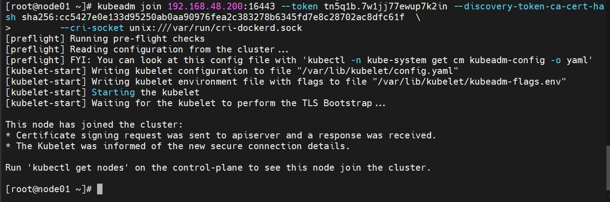
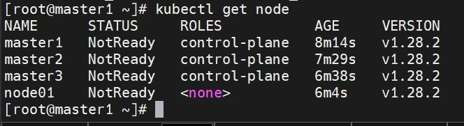
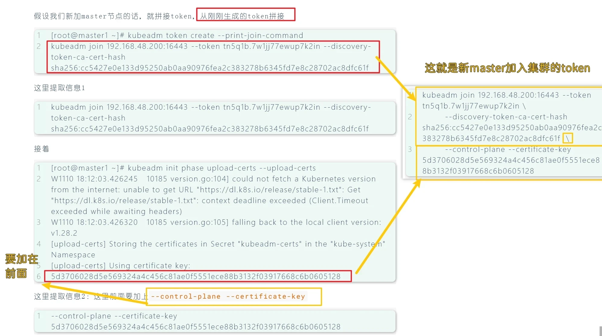
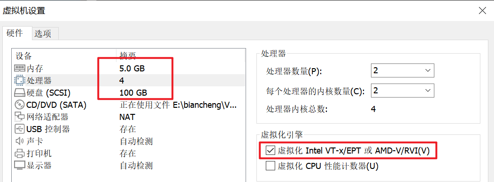
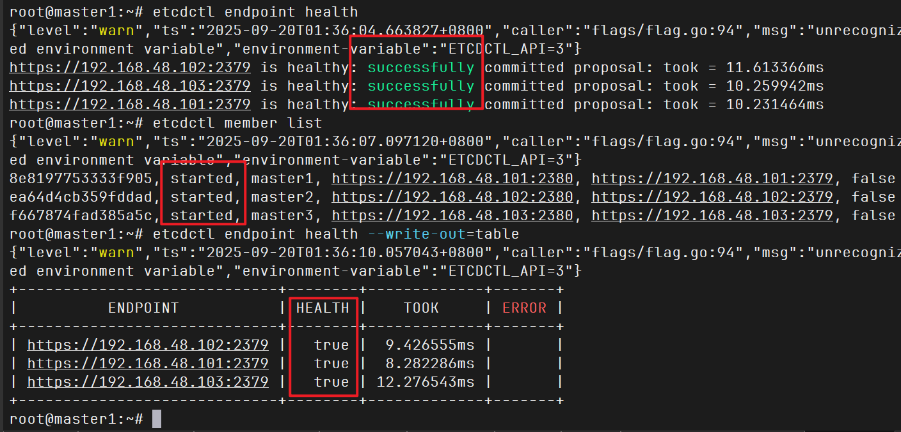
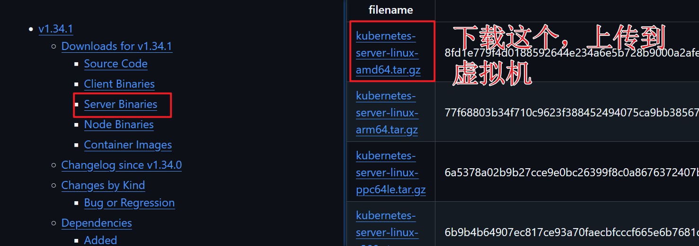
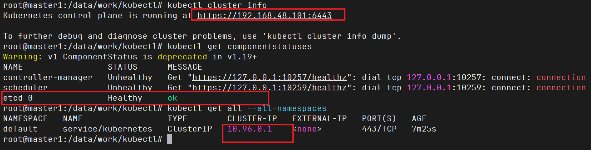
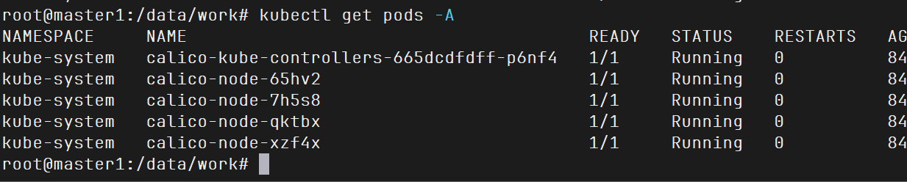
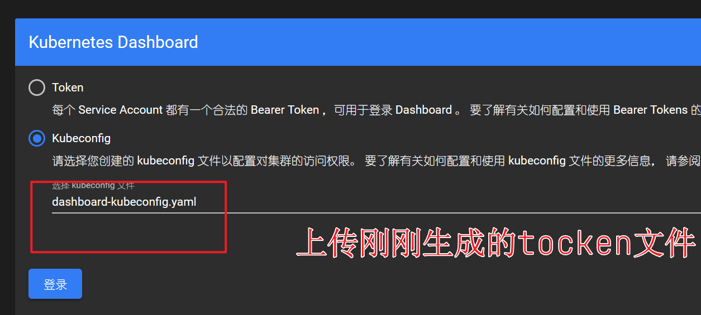

## K8s 介绍

### 基本结构

Kubernetes（简称 K8s）采用 `Master/Node`（控制面 / 工作节点） 的架构：

`Master` 节点：集群的大脑，负责管理和调度，保证系统运行在预期状态。

`Node` 节点（工作节点）：负责运行实际的业务容器（Pod）。

`etcd`：独立存储集群状态的分布式键值数据库。

K8s 可以部署成 `单 Master`（测试/小规模）或 `多 Master` 高可用（生产环境）。

### Master 节点组件

`kube-apiserver`

- 唯一对外接口，所有操作都通过 API Server 进行（kubectl、UI、控制器都要调用它）。
- 负责认证、授权、访问控制，把对象状态写入 etcd。

**`etcd`**

- 高可用键值数据库，保存集群的所有配置、状态信息。
- 类似 K8s 的“大脑存储”。

`kube-scheduler`

- 调度器，负责选择合适的 Node 来运行新建的 Pod。
- 根据资源、亲和性、污点等规则来分配 Pod。

`kube-controller-manager`

- 控制器集合，负责“自动化管理”：
  - Node 控制器（发现节点故障并重调度 Pod）
  - Replication 控制器（保证副本数一致）
  - Endpoint 控制器、命名空间控制器等。

### Node 节点组件

`kubelet`

- 运行在每个 Node 上，负责：
  - 和 API Server 通信
  - 管理本机 Pod 的生命周期（创建、启动、停止容器）
  - 上报节点状态。

`kube-proxy`

- 网络代理，负责 **Service 的负载均衡与转发**。
- 保证访问 Service 时能正确路由到对应 Pod。

`容器运行时（Container Runtime）`

- 负责启动和管理容器，例如 Docker（已逐步弃用）、containerd、CRI-O。

`CoreDNS`

- 集群内置的 DNS 服务，负责 **服务发现**。

`CNI 网络插件（如 Calico、Flannel）`

- 提供跨节点 Pod 网络互通和网络策略。

### 辅助工具

- **kubectl**：命令行管理工具，直接和 kube-apiserver 交互。
- **Dashboard**：可选的 Web UI。

### 核心资源

#### **工作负载类（Workloads）**

- **Pod**：最小的运行单元，封装一个或多个容器。
- **ReplicaSet**：确保指定数量的 Pod 副本数运行。
- **Deployment**：声明式管理应用的部署与滚动升级（基于 ReplicaSet）。
- **StatefulSet**：用于有状态服务，提供稳定的网络标识和存储。
- **DaemonSet**：确保每个（或指定）节点上运行一个 Pod（常用于日志、监控代理）。
- **Job**：一次性任务，保证任务完成。
- **CronJob**：定时任务，按时间周期调度 Job。

---

#### **服务发现与负载均衡（Service Discovery & Load Balancing）**

- **Service**：为一组 Pod 提供稳定访问入口（ClusterIP、NodePort、LoadBalancer）。
- **Endpoints**：Service 实际对应的 Pod IP 列表。
- **Ingress**：提供 HTTP/HTTPS 的七层路由入口。

---

#### **配置与存储（Configuration & Storage）**

- **ConfigMap**：保存非机密的配置数据，挂载到 Pod。
- **Secret**：保存敏感数据（密码、证书、Token）。
- **Volume**：Pod 使用的存储抽象。
- **PersistentVolume (PV)**：集群级别的持久化存储资源。
- **PersistentVolumeClaim (PVC)**：用户申请存储的声明。
- **StorageClass**：定义存储卷的动态供应策略。

---

#### **集群资源与节点管理（Cluster & Node Management）**

- **Node**：集群中的工作节点。
- **Namespace**：逻辑上的资源隔离。
- **ResourceQuota**：限制命名空间下的资源用量。
- **LimitRange**：限制 Pod 或容器的资源请求/上限。

---

#### **安全与访问控制（Security & Access Control）**

- **ServiceAccount**：Pod 在集群内的身份标识。
- **Role / ClusterRole**：定义资源的访问权限。
- **RoleBinding / ClusterRoleBinding**：将角色绑定到用户/组/ServiceAccount。
- **NetworkPolicy**：限制 Pod 之间或 Pod 与外部的网络通信。

## kubeadm安装单master的K8s

### 节点分布

| 主机名 | ip | 内存 | 硬盘 | cpu |
| --- | --- | --- | --- | --- |
| master1 | 192.168.48.128 | 5G | 100G | 2h2c |
| node01 | 192.168.48.10 | 5G | 100G | 2h2c |
| node02 | 192.168.48.20 | 5G | 100G | 2h2c |

所有系统均用ubuntu24.04搭建

所有节点按照如下图配置


### 系统初始化

操作节点：\[`所有节点`\]

```bash
cat > k8s-init.sh << "EOF1"
#!/bin/bash
# 作者: 严千屹
# 说明: Ubuntu 24.04 初始化脚本 (融合 ipvs + 内核优化参数)
# 使用: sh k8s-init.sh 主机名 主机位
# 例子: sh k8s-init.sh master1 101

#========================= 配置网段 =========================
NET_NUM=192.168.48

set -e

#========================= 颜色输出函数 =========================
color(){
    local nl=$'\n'
    case $1 in
        -n) nl=""; shift ;;  # -n 表示不换行
    esac
    case $# in
        1) color_name=white; text=$1 ;;
        2) color_name=$(echo "$1" | tr 'A-Z' 'a-z'); text=$2 ;;
        *) echo -e "用法：color [颜色] \"文本\""; return 1 ;;
    esac

    case $color_name in
        black) col=30 ;; red) col=31 ;; green) col=32 ;;
        yellow) col=33 ;; blue) col=34 ;; purple) col=35 ;;
        cyan) col=36 ;; *) col=37 ;;
    esac
    printf '\033[%sm%s\033[0m%s' "$col" "$text" "$nl"
}

#========================= 系统信息函数 =========================
sysinit_info(){
    . /etc/os-release
    Dev_name=$(ip route | grep '^default' | awk '{print $5}') # 网卡名
    local_ip=$(hostname -I | awk '{print $1}')                # 本机 IP
    IP_PREFIX=$(ip -o -f inet addr show $Dev_name | awk '{print $4}' | cut -d/ -f2)
    CPUS=$(nproc)

    color cyan "====== 系统信息 ======"
    color green "OS: $PRETTY_NAME"
    color green "网卡: $Dev_name"
    color green "IP: $local_ip/$IP_PREFIX"
    color green "网段: $NET_NUM"
    color green "CPU核心数: $CPUS"
    echo
}
sysinit_info

#========================= 参数检查 =========================
if [ $# -eq 2 ];then
  echo "设置主机名为：$1"
  echo "${Dev_name} 设置IP地址为：${NET_NUM}.$2"
else
  echo "使用方法：sh $0 主机名 主机位"
  exit 2
fi

echo "--------------------------------------"
echo "1. 设置主机名：$1"
hostnamectl set-hostname $1

echo "2. 关闭防火墙、swap"
systemctl disable ufw --now &>/dev/null || true
swapoff -a && sysctl -w vm.swappiness=0 &>/dev/null
sed -ri '/^[^#]*swap/s@^@#@' /etc/fstab

echo "3. 配置网卡 ${Dev_name}：${NET_NUM}.$2"
cat > /etc/netplan/50-netcfg.yaml <<EOF
network:
  version: 2
  ethernets:
    ${Dev_name}:
      dhcp4: no
      addresses:
        - ${NET_NUM}.$2/24
      routes:
        - to: default
          via: ${NET_NUM}.2
      nameservers:
        addresses: [114.114.114.114,8.8.8.8]
EOF
netplan apply

echo "4. 优化 SSH"
sed -i "s/#UseDNS yes/UseDNS no/" /etc/ssh/sshd_config || true
sed -i "s/GSSAPIAuthentication yes/GSSAPIAuthentication no/" /etc/ssh/sshd_config || true
systemctl restart ssh

echo "5. 添加 APT 源"
CODENAME=$(lsb_release -cs)
sudo tee /etc/apt/sources.list > /dev/null <<EOF
### 阿里云源 ###
deb https://mirrors.aliyun.com/ubuntu/ $CODENAME main restricted universe multiverse
deb https://mirrors.aliyun.com/ubuntu/ $CODENAME-updates main restricted universe multiverse
deb https://mirrors.aliyun.com/ubuntu/ $CODENAME-backports main restricted universe multiverse
deb https://mirrors.aliyun.com/ubuntu/ $CODENAME-security main restricted universe multiverse
EOF

echo "6. 修改 history 格式及记录数"
sed -i "/HISTSIZE/d" /etc/profile
cat > /etc/profile.d/init.sh <<'EOT'
shopt -s histappend
USER_IP=`who -u am i 2>/dev/null| awk '{print $NF}'|sed -e 's/[()]//g'`
export HISTFILE=~/.commandline_warrior
export HISTTIMEFORMAT="%Y-%m-%d %H:%M:%S  `whoami`@${USER_IP}: "
export HISTSIZE=200000
export HISTFILESIZE=1000000
export PROMPT_COMMAND="history -a"
EOT
source /etc/profile.d/init.sh
chmod +x /etc/profile.d/init.sh

echo "7. 添加 hosts 解析"
cat >> /etc/hosts <<EOF
192.168.48.128 master1
192.168.48.10 node01
192.168.48.20 node02
EOF

echo "8. 安装并启用 chrony 时间同步"
apt-get install -y chrony
systemctl enable --now chrony
chronyc sources

echo "9. 配置 limits.conf"
ulimit -SHn 65535
cat >> /etc/security/limits.conf <<EOF
* soft nofile 65536
* hard nofile 131072
* soft nproc 65535
* hard nproc 655350
* soft memlock unlimited
* hard memlock unlimited
EOF

echo "10. 加载内核模块"
modprobe br_netfilter
echo "br_netfilter" > /etc/modules-load.d/k8s.conf

#========================= 新增: ipvs 模块 =========================
echo "11. 安装 ipvs 组件"
apt-get install -y ipvsadm ipset sysstat conntrack libseccomp2

echo "12. 配置 ipvs 模块"
cat > /etc/modules-load.d/ipvs.conf <<EOF
ip_vs
ip_vs_lc
ip_vs_wlc
ip_vs_rr
ip_vs_wrr
ip_vs_lblc
ip_vs_lblcr
ip_vs_dh
ip_vs_sh
ip_vs_fo
ip_vs_nq
ip_vs_sed
ip_vs_ftp
nf_conntrack
ip_tables
ip_set
xt_set
ipt_set
ipt_rpfilter
ipt_REJECT
ipip
EOF
systemctl enable --now systemd-modules-load.service

#========================= 内核参数优化 =========================
echo "13. 配置 sysctl 参数"
cat > /etc/sysctl.d/k8s.conf <<EOF
net.ipv4.ip_nonlocal_bind = 1 
net.ipv4.ip_forward = 1
net.bridge.bridge-nf-call-iptables = 1
net.bridge.bridge-nf-call-ip6tables = 1
fs.may_detach_mounts = 1
net.ipv4.conf.all.route_localnet = 1
vm.overcommit_memory=1
vm.panic_on_oom=0
fs.inotify.max_user_watches=89100
fs.file-max=52706963
fs.nr_open=52706963
net.netfilter.nf_conntrack_max=2310720
net.ipv4.tcp_keepalive_time = 600
net.ipv4.tcp_keepalive_probes = 3
net.ipv4.tcp_keepalive_intvl =15
net.ipv4.tcp_max_tw_buckets = 36000
net.ipv4.tcp_tw_reuse = 1
net.ipv4.tcp_max_orphans = 327680
net.ipv4.tcp_orphan_retries = 3
net.ipv4.tcp_syncookies = 1
net.ipv4.tcp_max_syn_backlog = 16384
net.ipv4.tcp_timestamps = 0
net.core.somaxconn = 16384
EOF
sysctl --system

echo "14. 安装常用工具"
apt-get update -y 
apt-get install -y \
  lvm2 wget net-tools nfs-common lrzsz gcc g++ make cmake \
  libxml2-dev libssl-dev curl libcurl4-openssl-dev unzip sudo \
  ntp libaio-dev vim libncurses5-dev autoconf automake zlib1g-dev \
  python3-dev software-properties-common openssh-server socat conntrack

echo "15. 重启"
reboot
EOF1
```

```bash
bash k8s-init.sh 主机名 主机位
[master1] bash k8s-init.sh master1 128

[node01] bash k8s-init.sh node01 10

[node02] bash k8s-init.sh node02 20
```

### 免密脚本

操作节点：\[`所有节点`\]

```bash
apt install -y sshpass 
cat > sshmianmi.sh << "EOF"
#!/bin/bash
# 目标主机列表
hosts=(
master1
node01
node02
192.168.48.128
192.168.48.10
192.168.48.20
)
# 密码
password="123456"
# 生成 SSH 密钥对
ssh-keygen -t rsa -N "" -f ~/.ssh/id_rsa -q

# 循环遍历目标主机
for host in "${hosts[@]}"
do
    # 复制公钥到目标主机
    sshpass -p "$password" ssh-copy-id -o StrictHostKeyChecking=no "$host"
    
    # 验证免密登录
    sshpass -p "$password" ssh -o StrictHostKeyChecking=no "$host" "echo '免密登录成功'"
done
EOF

bash sshmianmi.sh
```

### 安装docker

操作节点：\[`所有节点`\]

```bash
cat >docker-install.sh <<"EOF2"
#!/bin/bash
set -e

# ================== 参数与提示 ==================
docker_version=$1
if [ -z "$docker_version" ]; then
    echo "请指定 Docker 版本，例如：bash docker-install.sh 28.4.0"
    exit 1
fi

docker_tgz="docker-${docker_version}.tgz"

echo "安装 Docker 版本: $docker_version"

# ================== 卸载旧版本 ==================
echo "卸载旧 Docker / containerd ..."
systemctl stop docker.service docker.socket containerd.service &>/dev/null || true
systemctl disable docker.service docker.socket containerd.service &>/dev/null || true
rm -f /etc/systemd/system/docker.service /etc/systemd/system/docker.socket /etc/systemd/system/containerd.service &>/dev/null
systemctl daemon-reload &>/dev/null
systemctl reset-failed &>/dev/null
rm -f /usr/bin/docker* /usr/bin/containerd* /usr/bin/ctr /usr/bin/runc &>/dev/null
rm -rf /etc/docker /var/lib/docker /var/lib/containerd &>/dev/null
groupdel docker &>/dev/null || true
rm -f docker-*.tgz &>/dev/null

echo "卸载完成."

# ================== 下载并安装 Docker ==================
if [ ! -f "$docker_tgz" ]; then
    echo "Docker 二进制包不存在，开始下载..."
    wget https://download.docker.com/linux/static/stable/x86_64/$docker_tgz &>/dev/null
else
    echo "Docker 二进制包已存在，跳过下载."
fi

tar xf "$docker_tgz" &>/dev/null
cp -rf docker/* /usr/bin/ &>/dev/null

# ================== 创建 docker 用户组 ==================
if ! getent group docker >/dev/null; then
    groupadd docker &>/dev/null
fi

# ================== 安装 containerd ==================
if ! command -v containerd >/dev/null; then
    apt-get update &>/dev/null
    apt-get install -y containerd &>/dev/null
fi

# ================== 创建 containerd systemd 服务 ==================
cat >/etc/systemd/system/containerd.service <<EOF
[Unit]
Description=containerd container runtime
Documentation=https://containerd.io
After=network.target local-fs.target

[Service]
ExecStartPre=-/sbin/modprobe overlay
ExecStart=/usr/bin/containerd
Type=notify
Delegate=yes
KillMode=process
Restart=always
RestartSec=5
LimitNPROC=infinity
LimitCORE=infinity
LimitNOFILE=1048576
TasksMax=infinity
OOMScoreAdjust=-999

[Install]
WantedBy=multi-user.target
EOF

systemctl daemon-reload &>/dev/null
systemctl enable --now containerd &>/dev/null

# ================== 创建 Docker systemd 服务 ==================
cat >/etc/systemd/system/docker.service <<EOF
[Unit]
Description=Docker Application Container Engine
Documentation=https://docs.docker.com
After=network-online.target containerd.service
Wants=network-online.target
Requires=docker.socket containerd.service

[Service]
Type=notify
ExecStart=/usr/bin/dockerd --config-file=/etc/docker/daemon.json
ExecReload=/bin/kill -s HUP \$MAINPID
TimeoutSec=0
RestartSec=2
Restart=always
StartLimitBurst=3
StartLimitInterval=60s
LimitNOFILE=infinity
LimitNPROC=infinity
LimitCORE=infinity
TasksMax=infinity
Delegate=yes
KillMode=process
OOMScoreAdjust=-500

[Install]
WantedBy=multi-user.target
EOF

# ================== 创建 Docker socket ==================
cat >/etc/systemd/system/docker.socket <<EOF
[Unit]
Description=Docker Socket for the API
[Socket]
ListenStream=/var/run/docker.sock
SocketMode=0660
SocketUser=root
SocketGroup=docker
[Install]
WantedBy=sockets.target
EOF

# ================== Docker 配置 ==================
mkdir -p /etc/docker &>/dev/null
cat >/etc/docker/daemon.json <<EOF
{
  "registry-mirrors": [
    "https://docker.xuanyuan.me",
    "https://docker.m.daocloud.io",
    "https://docker.1ms.run",
    "https://docker.1panel.live",
    "https://registry.cn-hangzhou.aliyuncs.com",
    "https://docker.qianyios.top",
    "https://ghcr.nju.edu.cn",
    "https://k8s.nju.edu.cn"
  ],
  "hosts": ["unix:///var/run/docker.sock"],
  "max-concurrent-downloads": 10,
  "log-driver": "json-file",
  "log-level": "warn",
  "log-opts": {
    "max-size": "10m",
    "max-file": "3"
  },
  "data-root": "/var/lib/docker",
  "live-restore": true
}
EOF

# ================== 启动 Docker ==================
systemctl daemon-reload &>/dev/null
systemctl enable --now docker.socket &>/dev/null
systemctl enable --now docker.service &>/dev/null

# ================== 验证 ==================
docker version &>/dev/null
docker info &>/dev/null

echo "Docker $docker_version 安装完成！"
EOF2
```

运行脚本

28.4.0是docker的最新版本

要更改版本可以看这里 [https://download.docker.com/linux/static/stable/x86\_64/](https://download.docker.com/linux/static/stable/x86_64/)

```bash
bash docker-install.sh 28.4.0
```

验证

```bash
docker -v
```

```bash
root@master1:~# docker -v
Docker version 28.4.0, build d8eb465
root@node01:~# docker -v
Docker version 28.4.0, build d8eb465
root@node02:~# docker -v
Docker version 28.4.0, build d8eb465
```

### 安装cri-docker

操作节点：\[`所有节点`\]

```bash
cat > cri-docker.sh <<"EOF1"
#!/bin/bash
set -e

# ================== 获取版本号 ==================
# 第一个位置参数是版本号，默认 0.3.7
VERSION=${1:-0.3.7}
FILE="cri-dockerd-${VERSION}.amd64.tgz"

echo "安装 cri-dockerd 版本: $VERSION"

# ================== 下载 cri-dockerd ==================
if [ ! -f "$FILE" ]; then
    echo "下载 cri-dockerd..."
    wget -O "$FILE" "https://github.com/Mirantis/cri-dockerd/releases/download/v${VERSION}/$FILE" &>/dev/null
fi

# ================== 尝试解压，失败就重下再解 ==================
if ! tar -zxf "$FILE" &>/dev/null; then
    echo "解压失败，重新下载..."
    wget -O "$FILE" "https://github.com/Mirantis/cri-dockerd/releases/download/v${VERSION}/$FILE" &>/dev/null
    tar -zxvf "$FILE" &>/dev/null
fi

cp -f cri-dockerd/cri-dockerd /usr/bin/ &>/dev/null
chmod +x /usr/bin/cri-dockerd &>/dev/null

# ================== 创建 systemd 服务 ==================
cat >/etc/systemd/system/cri-docker.service <<'EOF'
[Unit]
Description=CRI Interface for Docker Application Container Engine
Documentation=https://docs.mirantis.com
After=network-online.target docker.service
Wants=network-online.target
Requires=cri-docker.socket

[Service]
Type=notify
ExecStart=/usr/bin/cri-dockerd --network-plugin=cni --pod-infra-container-image=registry.aliyuncs.com/google_containers/pause:3.9
ExecReload=/bin/kill -s HUP $MAINPID
TimeoutSec=0
RestartSec=2
Restart=always
StartLimitBurst=3
StartLimitInterval=60s
LimitNOFILE=infinity
LimitNPROC=infinity
LimitCORE=infinity
TasksMax=infinity
Delegate=yes
KillMode=process

[Install]
WantedBy=multi-user.target
EOF

# ================== 创建 socket 文件 ==================
cat >/etc/systemd/system/cri-docker.socket <<'EOF'
[Unit]
Description=CRI Docker Socket for the API
PartOf=cri-docker.service

[Socket]
ListenStream=%t/cri-dockerd.sock
SocketMode=0660
SocketUser=root
SocketGroup=docker

[Install]
WantedBy=sockets.target
EOF

# ================== 启动服务 ==================
systemctl daemon-reload &>/dev/null
systemctl enable cri-docker.service --now &>/dev/null
systemctl enable cri-docker.socket --now &>/dev/null

echo "cri-dockerd 版本 $VERSION 安装完成并启动成功！"


EOF1
```

运行

```bash
bash cri-docker.sh 0.3.20
```

验证

```bash
cri-dockerd --version
```

```bash
root@master1:~# cri-dockerd --version
cri-dockerd 0.3.20 (b11203a)
root@node01:~# cri-dockerd --version
cri-dockerd 0.3.20 (b11203a)
root@node02:~# cri-dockerd --version
cri-dockerd 0.3.20 (b11203a)
```

### 配置k8s源并安装k8s基础工具

操作节点：`所有节点`

自行修改版本，版本查看网站：[https://mirrors.aliyun.com/kubernetes-new/core/stable/](https://mirrors.aliyun.com/kubernetes-new/core/stable/)

这里安装最新版：1.34

```bash
#这里可以修改版本
k8s_version=1.34
rm -rf /etc/apt/sources.list.d/kubernetes.list
apt-get update -y && apt-get install -y apt-transport-https
curl -fsSL https://mirrors.aliyun.com/kubernetes-new/core/stable/v1.28/deb/Release.key |
    gpg --dearmor -o /etc/apt/keyrings/kubernetes-apt-keyring.gpg
echo "deb [signed-by=/etc/apt/keyrings/kubernetes-apt-keyring.gpg] https://mirrors.aliyun.com/kubernetes-new/core/stable/v${k8s_version}/deb/ /" |
    tee /etc/apt/sources.list.d/kubernetes.list
apt-get update -y
apt-get install -y kubelet kubeadm kubectl
systemctl enable kubelet --now
```

> **`Kubeadm`: kubeadm 是一个工具，用来初始化 k8s 集群的**
>
> **`kubelet`: 安装在集群所有节点上，用于启动 Pod 的**
>
> **`kubectl`: 通过 kubectl 可以部署和管理应用，查看各种资源，创建、删除和更新各种组件**
>
> `kubelet`暂时`不会启动`，等后面安装完k8s组件就会正常启动

验证

```bash
kubeadm version
kubectl version
```

```bash
#其他节点都一样，就不列举了
root@master1:~# kubectl version
Client Version: v1.34.1
Kustomize Version: v5.7.1
The connection to the server localhost:8080 was refused - did you specify the right host or port?
root@master1:~# kubeadm version
kubeadm version: &version.Info{Major:"1", Minor:"34", ......
```

### 初始化集群

操作节点:master1

```bash
kubeadm init \
  --kubernetes-version=1.34.1 \
  --apiserver-advertise-address=192.168.48.128 \
  --image-repository=registry.aliyuncs.com/google_containers \
  --pod-network-cidr=10.244.0.0/16 \
  --service-cidr=10.96.0.0/12 \
  --cri-socket=unix:///var/run/cri-dockerd.sock 
```

`--kubernetes-version=1.34.1` 指定安装的 **Kubernetes 版本**。

`--apiserver-advertise-address=192.168.48.128` 设置 **API Server 对外通信的 IP 地址**（Master 节点 IP）。

`--image-repository=registry.aliyuncs.com/google_containers` 指定 **镜像仓库地址**（国内用阿里云替代 gcr.io，避免拉取失败）。

`--pod-network-cidr=10.244.0.0/16` 设置 **Pod 网络网段**，常配合 **Flannel** 使用。

`--service-cidr=10.96.0.0/12` 设置 **Service 网络网段**，和 Pod 网段必须不重叠。

`--cri-socket=unix:///var/run/cri-dockerd.sock` 指定 **容器运行时接口 (CRI) 的 socket**，这里用 `cri-dockerd` 来支持 Docker。

`生成信息`

```bash
[addons] Applied essential addon: kube-proxy

Your Kubernetes control-plane has initialized successfully!

To start using your cluster, you need to run the following as a regular user:

  mkdir -p $HOME/.kube
  sudo cp -i /etc/kubernetes/admin.conf $HOME/.kube/config
  sudo chown $(id -u):$(id -g) $HOME/.kube/config

Alternatively, if you are the root user, you can run:

  export KUBECONFIG=/etc/kubernetes/admin.conf

You should now deploy a pod network to the cluster.
Run "kubectl apply -f [podnetwork].yaml" with one of the options listed at:
  https://kubernetes.io/docs/concepts/cluster-administration/addons/

Then you can join any number of worker nodes by running the following on each as root:

kubeadm join 192.168.48.128:6443 --token 2stq66.dv1wkt19cv2hn4ha \
        --discovery-token-ca-cert-hash sha256:170a410f93da8ce4e7487521f171e0300bd0872e54a0f653340f736afa69989a
root@master1:~#
```

设置环境变量

```bash
mkdir -p $HOME/.kube
sudo cp -i /etc/kubernetes/admin.conf $HOME/.kube/config
sudo chown $(id -u):$(id -g) $HOME/.kube/config
```

如果想重置就输入这个

```bash
kubeadm reset --cri-socket=unix:///var/run/cri-dockerd.sock -f
```

### node节点加入集群

根据前面master节点初始化信息，里面有如下信息，通过这个给所有node节点加入集群，还要再结尾加上`--cri-socket=unix:///var/run/cri-dockerd.sock`

```bash
kubeadm join 192.168.48.128:6443 \
  --token 2stq66.dv1wkt19cv2hn4ha \
  --discovery-token-ca-cert-hash sha256:170a410f93da8ce4e7487521f171e0300bd0872e54a0f653340f736afa69989a \
  --cri-socket=unix:///var/run/cri-dockerd.sock
```

### 安装calico

操作节点:master1

网络组件有很多种，只需要部署其中一个即可，推荐Calico。 Calico是一个纯三层的数据中心网络方案，Calico支持广泛的平台，包括Kubernetes、OpenStack等。 Calico 在每一个计算节点利用 Linux Kernel 实现了一个高效的虚拟路由器（ vRouter） 来负责数据转发，而每个 vRouter 通过 BGP 协议负责把自己上运行的 workload 的路由信息向整个 Calico 网络内传播。 此外，Calico 项目还实现了 Kubernetes 网络策略，提供ACL功能

```bash
echo '185.199.108.133 raw.githubusercontent.com' >> /etc/hosts
curl https://qygit.qianyisky.cn/https://raw.githubusercontent.com/projectcalico/calico/v3.30.3/manifests/calico.yaml -O
```

calico文件可能下载不下来，你直接魔法下载，然后上传到虚拟机计科

```bash
Dev_name=$(ip route | grep '^default' | awk '{print $5}')
sed -i "/- name: WAIT_FOR_DATASTORE/i \ \ \ \ \ \ \ \ \ \ \ \ - name: IP_AUTODETECTION_METHOD\n              value: interface=${Dev_name}" calico.yaml
sed -i 's| docker.io/calico/| registry.cn-hangzhou.aliyuncs.com/qianyios/|' calico.yaml
kubectl apply -f calico.yaml
```

要等很久，之后就是如下情况，全是ready，全是running，才说明k8s安装成功

```bash
root@master1:~# kubectl get nodes
NAME      STATUS   ROLES           AGE   VERSION
master1   Ready    control-plane   37m   v1.34.1
node01    Ready    <none>          36m   v1.34.1
node02    Ready    <none>          36m   v1.34.1
root@master1:~# kubectl get pods -A
NAMESPACE     NAME                                       READY   STATUS    RESTARTS   AGE
kube-system   calico-kube-controllers-59556d9b4c-kjx6h   1/1     Running   0          11m
kube-system   calico-node-26bn8                          1/1     Running   0          11m
kube-system   calico-node-hn8zc                          1/1     Running   0          11m
kube-system   calico-node-lkqnz                          1/1     Running   0          11m
kube-system   coredns-7cc97dffdd-jhsrk                   1/1     Running   0          38m
kube-system   coredns-7cc97dffdd-lw8gq                   1/1     Running   0          38m
kube-system   etcd-master1                               1/1     Running   0          38m
kube-system   kube-apiserver-master1                     1/1     Running   0          38m
kube-system   kube-controller-manager-master1            1/1     Running   0          38m
kube-system   kube-proxy-5lhct                           1/1     Running   0          36m
kube-system   kube-proxy-98zcg                           1/1     Running   0          38m
kube-system   kube-proxy-zz66z                           1/1     Running   0          36m
kube-system   kube-scheduler-master1                     1/1     Running   0          38m
```

### 安装dashboard

```bash
sudo wget https://raw.githubusercontent.com/kubernetes/dashboard/v2.7.0/aio/deploy/recommended.yaml && \
sudo sed -i 's/kubernetesui\/dashboard:v2.7.0/registry.cn-hangzhou.aliyuncs.com\/qianyios\/dashboard:v2.7.0/g' recommended.yaml 
sleep 3
sudo sed -i 's/kubernetesui\/metrics-scraper:v1.0.8/registry.cn-hangzhou.aliyuncs.com\/qianyios\/metrics-scraper:v1.0.8/g' recommended.yaml 
sudo sed -i '/targetPort: 8443/a\      nodePort: 30001' recommended.yaml 
sudo sed -i '/nodePort: 30001/a\  type: NodePort' recommended.yaml
```

运行

```bash
kubectl apply -f recommended.yaml
kubectl get pods -n kubernetes-dashboard
```

验证，两个都是running

```bash
root@master1:~# kubectl get pods -n kubernetes-dashboard
NAME                                         READY   STATUS    RESTARTS   AGE
dashboard-metrics-scraper-697d7fd947-nv5fk   1/1     Running   0          25s
kubernetes-dashboard-9b54d5-vjj67            1/1     Running   0          25s
```

创建token，直接全选复制运行

```bash
#创建service account并绑定默认cluster-admin管理员群角色
#创建用户
sudo kubectl create serviceaccount dashboard-admin -n kubernetes-dashboard
#用户授权
sudo kubectl create clusterrolebinding dashboard-admin \
--clusterrole=cluster-admin \
--serviceaccount=kubernetes-dashboard:dashboard-admin
#临时获取用户Token（默认只有 30 分钟 ）
sudo kubectl create token dashboard-admin -n kubernetes-dashboard
#永久获取用户Token
sudo cat <<EOF | sudo kubectl apply -f -
apiVersion: v1
kind: Secret
metadata:
  name: dashboard-admin-token
  namespace: kubernetes-dashboard
  annotations:
    kubernetes.io/service-account.name: dashboard-admin
type: kubernetes.io/service-account-token
EOF

KUBECONFIG_FILE="dashboard-kubeconfig.yaml"

# 自动获取 API Server 地址
APISERVER=$(sudo kubectl config view --minify -o jsonpath='{.clusters[0].cluster.server}')

# 自动获取 CA 证书
CA_CERT=$(sudo kubectl config view --raw -o jsonpath='{.clusters[0].cluster.certificate-authority-data}')

# 自动从 Secret 获取 Token（你提到的正确方式）
TOKEN=$(sudo kubectl get secret dashboard-admin-token -n kubernetes-dashboard -o jsonpath='{.data.token}' | base64 --decode)

# 生成 kubeconfig 文件
sudo cat <<EOF > ${KUBECONFIG_FILE}
apiVersion: v1
kind: Config
clusters:
  - name: kubernetes
    cluster:
      server: ${APISERVER}
      certificate-authority-data: ${CA_CERT}
users:
  - name: dashboard-admin
    user:
      token: ${TOKEN}
contexts:
  - name: dashboard-context
    context:
      cluster: kubernetes
      user: dashboard-admin
current-context: dashboard-context
EOF

echo "✅ kubeconfig 文件已生成：${KUBECONFIG_FILE}"
```

这时候就会提示你

✅ kubeconfig 文件已生成：dashboard-kubeconfig.yaml

你就把这个文件上传到dashboard的kubeconfig就可以免密登入了

访问页面[https://192.168.48.128:30001](https://192.168.48.128:30001)


### 修改mode支持ipvs

修改器请确认你的机子是否支持ipvs，我已经在`2.2 系统初始化`的脚本里设置了ipvs功能，你要是没用我的，你可以自行看看脚本，或者自行配置

```bash
root@master1:~# kubectl get configmap kube-proxy -n kube-system -o yaml | grep mode
    mode: "" #可能为空，也可能是iptables
```

那这样他是不支持ipvs要进行修改

```bash
kubectl edit configmap kube-proxy -n kube-system
```

然后修改为`mode: "ipvs"`


重启kube-proxy Pods

```bash
kubectl delete pod -n kube-system -l k8s-app=kube-proxy
```

检查是否可用

```bash
#然后你就会看见一大堆的规则，那他表示 IPVS 已启用。
root@master1:~# ipvsadm -L -n
IP Virtual Server version 1.2.1 (size=4096)
Prot LocalAddress:Port Scheduler Flags
  -> RemoteAddress:Port           Forward Weight ActiveConn InActConn
TCP  172.17.0.1:30001 rr
  -> 10.244.196.158:8443          Masq    1      0          0
TCP  172.17.0.1:30080 rr
  -> 10.244.196.159:80            Masq    1      0          0
  -> 10.244.196.160:80            Masq    1      0          0
TCP  192.168.48.128:30001 rr
  -> 10.244.196.158:8443          Masq    1      0          0
TCP  192.168.48.128:30080 rr
  -> 10.244.196.159:80            Masq    1      0          0
  -> 10.244.196.160:80            Masq    1      0          0
TCP  10.96.0.1:443 rr
  -> 192.168.48.128:6443          Masq    1      8          0
TCP  10.96.0.10:53 rr
  -> 10.244.137.89:53             Masq    1      0          0
  -> 10.244.137.90:53             Masq    1      0          0
TCP  10.96.0.10:9153 rr
......
```

### 验证是否可以创建服务

```bash
root@master1:~# kubectl run nginx --image=registry.cn-hangzhou.aliyuncs.com/qianyios/nginx:latest   --restart=Never --rm -it -- nginx -v
.......
nginx version: nginx/1.29.1 #输出版本即正常
pod "nginx" deleted from default namespace
root@master1:~#
```

k8s单master安装成功

### 模拟Token过期重新生成并加入Node节点

假设加入集群的token过期了。node01无法加入了，这里就模拟一下这种情况

1. Token过期后生成新的token：

```bash
kubeadm token create --print-join-command
```

```text
[root@master1 ~]# kubeadm token create --print-join-command
kubeadm join 192.168.48.200:16443 --token tn5q1b.7w1jj77ewup7k2in --discovery-token-ca-cert-hash sha256:cc5427e0e133d95250ab0aa90976fea2c383278b6345fd7e8c28702ac8dfc61f
```

其中，`192.168.48.200:16443` 是你的 Kubernetes API 服务器的地址和端口，`tn5q1b.7w1jj77ewup7k2in` 是新的令牌，`sha256:cc5427e0e133d95250ab0aa90976fea2c383278b6345fd7e8c28702ac8dfc61f` 是令牌的 CA 证书哈希值。

2. Master需要生成--certificate-key：

```bash
kubeadm init phase upload-certs --upload-certs
```

```text
[root@master1 ~]# kubeadm init phase upload-certs --upload-certs
W1110 18:12:03.426245   10185 version.go:104] could not fetch a Kubernetes version from the internet: unable to get URL "https://dl.k8s.io/release/stable-1.txt": Get "https://dl.k8s.io/release/stable-1.txt": context deadline exceeded (Client.Timeout exceeded while awaiting headers)
W1110 18:12:03.426320   10185 version.go:105] falling back to the local client version: v1.28.2
[upload-certs] Storing the certificates in Secret "kubeadm-certs" in the "kube-system" Namespace
[upload-certs] Using certificate key:
5d3706028d5e569324a4c456c81ae0f5551ece88b3132f03917668c6b0605128
```

其中，`5d3706028d5e569324a4c456c81ae0f5551ece88b3132f03917668c6b0605128` 是证书密钥。

3. 生成新的Token用于集群添加新Node节点

操作节点\[node01\]

```text
kubeadm join 192.168.48.200:16443 --token tn5q1b.7w1jj77ewup7k2in --discovery-token-ca-cert-hash sha256:cc5427e0e133d95250ab0aa90976fea2c383278b6345fd7e8c28702ac8dfc61f  \
        --cri-socket unix:///var/run/cri-dockerd.sock 
```

注意：这里末尾添加了`--cri-socket unix:///var/run/cri-dockerd.sock `



这时在master查看node状态（显示为notready不影响）



### 模拟新加master节点的加入K8S集群中

假设我们新加master节点的话，就拼接token，`从刚刚生成的token拼接`

```text
[root@master1 ~]# kubeadm token create --print-join-command
kubeadm join 192.168.48.200:16443 --token tn5q1b.7w1jj77ewup7k2in --discovery-token-ca-cert-hash sha256:cc5427e0e133d95250ab0aa90976fea2c383278b6345fd7e8c28702ac8dfc61f
```

这里提取信息1

```text
kubeadm join 192.168.48.200:16443 --token tn5q1b.7w1jj77ewup7k2in --discovery-token-ca-cert-hash sha256:cc5427e0e133d95250ab0aa90976fea2c383278b6345fd7e8c28702ac8dfc61f
```

接着

```text
[root@master1 ~]# kubeadm init phase upload-certs --upload-certs
W1110 18:12:03.426245   10185 version.go:104] could not fetch a Kubernetes version from the internet: unable to get URL "https://dl.k8s.io/release/stable-1.txt": Get "https://dl.k8s.io/release/stable-1.txt": context deadline exceeded (Client.Timeout exceeded while awaiting headers)
W1110 18:12:03.426320   10185 version.go:105] falling back to the local client version: v1.28.2
[upload-certs] Storing the certificates in Secret "kubeadm-certs" in the "kube-system" Namespace
[upload-certs] Using certificate key:
5d3706028d5e569324a4c456c81ae0f5551ece88b3132f03917668c6b0605128
```

这里提取信息2：这里前面要加上`--control-plane --certificate-key`

```text
--control-plane --certificate-key 5d3706028d5e569324a4c456c81ae0f5551ece88b3132f03917668c6b0605128
```

合成

```text
kubeadm join 192.168.48.200:16443 --token tn5q1b.7w1jj77ewup7k2in \
        --discovery-token-ca-cert-hash sha256:cc5427e0e133d95250ab0aa90976fea2c383278b6345fd7e8c28702ac8dfc61f  \
        --control-plane --certificate-key 5d3706028d5e569324a4c456c81ae0f5551ece88b3132f03917668c6b0605128 \
        --cri-socket unix:///var/run/cri-dockerd.sock
        
        
kubeadm join 192.168.48.200:16443 --token lnkno8.u4v1l8n9pahzf0kj \
        --discovery-token-ca-cert-hash sha256:cc5427e0e133d95250ab0aa90976fea2c383278b6345fd7e8c28702ac8dfc61f \
        --control-plane --certificate-key 41e441fe56cb4bdfcc2fc0291958e6b1da54d01f4649b6651471c07583f85cdf \
        --cri-socket unix:///var/run/cri-dockerd.sock
```

注意：这里末尾添加了`--cri-socket unix:///var/run/cri-dockerd.sock `

图示



## kubeadm部署高可用K8s

请前往[https://blog.qianyios.top/tags/K8s/](https://blog.qianyios.top/tags/K8s/)

我的文章里会有一些高可用的，有centos，openeuler，但是没有ubuntu，都差不多的

## 二进制安装高可用K8S

### 节点分布

所有系统均用ubuntu24.04搭建

| 主机名 | IP | 内存 | 硬盘 | CPU | 软件 |
| --- | --- | --- | --- | --- | --- |
| master1 | 192.168.48.101 | 5G | 100G | 2h2c | kube-apiserver、kubectl、kube-controller-manager、kube-scheduler、haproxy、keepalived |
| master2 | 192.168.48.102 | 5G | 100G | 2h2c | kube-apiserver、kubectl、kube-controller-manager、kube-scheduler、haproxy、keepalived |
| master3 | 192.168.48.103 | 5G | 100G | 2h2c | kube-apiserver、kubectl、kube-controller-manager、kube-scheduler、haproxy |
| node01 | 192.168.48.10 | 5G | 100G | 2h2c | kubelet、kube-proxy、Docker-ce、cri-dockerd |

所有节点按照如下图配置



### 系统初始化

操作节点：\[`所有节点`\]

```bash
mkdir /data/work -p && cd /data/work
cat > /data/work/k8s-init.sh << "EOF1"
#!/bin/bash
# 作者: 严千屹
# 说明: Ubuntu 24.04 初始化脚本 (融合 ipvs + 内核优化参数)
# 使用: sh k8s-init.sh 主机名 主机位
# 例子: sh k8s-init.sh master1 101

#========================= 配置网段 =========================
NET_NUM=192.168.48

set -e

#========================= 颜色输出函数 =========================
color(){
    local nl=$'\n'
    case $1 in
        -n) nl=""; shift ;;  # -n 表示不换行
    esac
    case $# in
        1) color_name=white; text=$1 ;;
        2) color_name=$(echo "$1" | tr 'A-Z' 'a-z'); text=$2 ;;
        *) echo -e "用法：color [颜色] \"文本\""; return 1 ;;
    esac

    case $color_name in
        black) col=30 ;; red) col=31 ;; green) col=32 ;;
        yellow) col=33 ;; blue) col=34 ;; purple) col=35 ;;
        cyan) col=36 ;; *) col=37 ;;
    esac
    printf '\033[%sm%s\033[0m%s' "$col" "$text" "$nl"
}

#========================= 系统信息函数 =========================
sysinit_info(){
    . /etc/os-release
    Dev_name=$(ip route | grep '^default' | awk '{print $5}') # 网卡名
    local_ip=$(hostname -I | awk '{print $1}')                # 本机 IP
    IP_PREFIX=$(ip -o -f inet addr show $Dev_name | awk '{print $4}' | cut -d/ -f2)
    CPUS=$(nproc)

    color cyan "====== 系统信息 ======"
    color green "OS: $PRETTY_NAME"
    color green "网卡: $Dev_name"
    color green "IP: $local_ip/$IP_PREFIX"
    color green "网段: $NET_NUM"
    color green "CPU核心数: $CPUS"
    echo
}
sysinit_info

#========================= 参数检查 =========================
if [ $# -eq 2 ];then
  echo "设置主机名为：$1"
  echo "${Dev_name} 设置IP地址为：${NET_NUM}.$2"
else
  echo "使用方法：sh $0 主机名 主机位"
  exit 2
fi

echo "--------------------------------------"
echo "1. 设置主机名：$1"
hostnamectl set-hostname $1

echo "2. 关闭防火墙、swap"
systemctl disable ufw --now &>/dev/null || true
swapoff -a && sysctl -w vm.swappiness=0 &>/dev/null
sed -ri '/^[^#]*swap/s@^@#@' /etc/fstab

echo "3. 配置网卡 ${Dev_name}：${NET_NUM}.$2"
cat > /etc/netplan/50-netcfg.yaml <<EOF
network:
  version: 2
  ethernets:
    ${Dev_name}:
      dhcp4: no
      addresses:
        - ${NET_NUM}.$2/24
      routes:
        - to: default
          via: ${NET_NUM}.2
      nameservers:
        addresses: [114.114.114.114,8.8.8.8]
EOF
netplan apply

echo "4. 优化 SSH"
sed -i "s/#UseDNS yes/UseDNS no/" /etc/ssh/sshd_config || true
sed -i "s/GSSAPIAuthentication yes/GSSAPIAuthentication no/" /etc/ssh/sshd_config || true
systemctl restart ssh

echo "5. 添加 APT 源"
CODENAME=$(lsb_release -cs)
sudo tee /etc/apt/sources.list > /dev/null <<EOF
### 阿里云源 ###
deb https://mirrors.aliyun.com/ubuntu/ $CODENAME main restricted universe multiverse
deb https://mirrors.aliyun.com/ubuntu/ $CODENAME-updates main restricted universe multiverse
deb https://mirrors.aliyun.com/ubuntu/ $CODENAME-backports main restricted universe multiverse
deb https://mirrors.aliyun.com/ubuntu/ $CODENAME-security main restricted universe multiverse
EOF

echo "6. 修改 history 格式及记录数"
sed -i "/HISTSIZE/d" /etc/profile
cat > /etc/profile.d/init.sh <<'EOT'
shopt -s histappend
USER_IP=`who -u am i 2>/dev/null| awk '{print $NF}'|sed -e 's/[()]//g'`
export HISTFILE=~/.commandline_warrior
export HISTTIMEFORMAT="%Y-%m-%d %H:%M:%S  `whoami`@${USER_IP}: "
export HISTSIZE=200000
export HISTFILESIZE=1000000
export PROMPT_COMMAND="history -a"
EOT
source /etc/profile.d/init.sh
chmod +x /etc/profile.d/init.sh

echo "7. 添加 hosts 解析"
cat >> /etc/hosts <<EOF
192.168.48.101 master1
192.168.48.102 master2
192.168.48.103 master3
192.168.48.10 node01
EOF

echo "8. 安装并启用 chrony 时间同步"

sudo apt -y install chrony &>/dev/null
sudo sed -i '/^pool /d' /etc/chrony/chrony.conf && sudo sed -i '1i pool ntp.aliyun.com iburst maxsources 1' /etc/chrony/chrony.conf
sudo timedatectl set-timezone Asia/Shanghai &>/dev/null
sudo systemctl enable chrony --now &>/dev/null
sudo systemctl restart chrony &>/dev/null

echo "9. 配置 limits.conf"
ulimit -SHn 65535
cat >> /etc/security/limits.conf <<EOF
* soft nofile 65536
* hard nofile 131072
* soft nproc 65535
* hard nproc 655350
* soft memlock unlimited
* hard memlock unlimited
EOF

echo "10. 加载内核模块"
modprobe br_netfilter
echo "br_netfilter" > /etc/modules-load.d/k8s.conf

#========================= 新增: ipvs 模块 =========================
echo "11. 安装 ipvs 组件"
apt-get install -y ipvsadm ipset sysstat conntrack libseccomp2

echo "12. 配置 ipvs 模块"
cat > /etc/modules-load.d/ipvs.conf <<EOF
ip_vs
ip_vs_lc
ip_vs_wlc
ip_vs_rr
ip_vs_wrr
ip_vs_lblc
ip_vs_lblcr
ip_vs_dh
ip_vs_sh
ip_vs_fo
ip_vs_nq
ip_vs_sed
ip_vs_ftp
nf_conntrack
ip_tables
ip_set
xt_set
ipt_set
ipt_rpfilter
ipt_REJECT
ipip
EOF
systemctl enable --now systemd-modules-load.service

#========================= 内核参数优化 =========================
echo "13. 配置 sysctl 参数"
cat > /etc/sysctl.d/k8s.conf <<EOF
net.ipv4.ip_nonlocal_bind = 1 
net.ipv4.ip_forward = 1
net.bridge.bridge-nf-call-iptables = 1
net.bridge.bridge-nf-call-ip6tables = 1
fs.may_detach_mounts = 1
net.ipv4.conf.all.route_localnet = 1
vm.overcommit_memory=1
vm.panic_on_oom=0
fs.inotify.max_user_watches=89100
fs.file-max=52706963
fs.nr_open=52706963
net.netfilter.nf_conntrack_max=2310720
net.ipv4.tcp_keepalive_time = 600
net.ipv4.tcp_keepalive_probes = 3
net.ipv4.tcp_keepalive_intvl =15
net.ipv4.tcp_max_tw_buckets = 36000
net.ipv4.tcp_tw_reuse = 1
net.ipv4.tcp_max_orphans = 327680
net.ipv4.tcp_orphan_retries = 3
net.ipv4.tcp_syncookies = 1
net.ipv4.tcp_max_syn_backlog = 16384
net.ipv4.tcp_timestamps = 0
net.core.somaxconn = 16384
EOF
sysctl --system

echo "14. 安装常用工具"
apt-get update -y 
apt-get install -y \
  lvm2 wget net-tools nfs-common lrzsz gcc g++ make cmake \
  libxml2-dev libssl-dev curl libcurl4-openssl-dev unzip sudo \
  ntp libaio-dev vim libncurses5-dev autoconf automake zlib1g-dev \
  python3-dev software-properties-common openssh-server socat conntrack

echo "15. 重启"
reboot
EOF1
```

```bash
bash k8s-init.sh 主机名 主机位
[master1] bash k8s-init.sh master1 101

[master2] bash k8s-init.sh master2 102

[master3] bash k8s-init.sh master3 103

[node01] bash k8s-init.sh node01 10
```

### 免密脚本

操作节点：\[`所有节点`\]

```bash
apt install -y sshpass 
mkdir /data/work -p && cd /data/work
cat > /data/work/sshmianmi.sh << "EOF"
#!/bin/bash
# 目标主机列表
hosts=(
master1
master2
master3
node01
192.168.48.101
192.168.48.102
192.168.48.103
192.168.48.10
)
# 密码
password="123456"
# 生成 SSH 密钥对
ssh-keygen -t rsa -N "" -f ~/.ssh/id_rsa -q

# 循环遍历目标主机
for host in "${hosts[@]}"
do
    # 复制公钥到目标主机
    sshpass -p "$password" ssh-copy-id -o StrictHostKeyChecking=no "$host"
    
    # 验证免密登录
    sshpass -p "$password" ssh -o StrictHostKeyChecking=no "$host" "echo '免密登录成功'"
done
EOF

bash sshmianmi.sh
```

### 负载均衡部署

操作节点：master1和master2

```bash
apt install -y haproxy keepalived
cat > /etc/haproxy/haproxy.cfg <<"EOF"

global
  maxconn  2000
  ulimit-n  16384
  log  127.0.0.1 local0 err
  stats timeout 30s

defaults
  log global
  mode  http
  option  httplog
  timeout connect 5000
  timeout client  50000
  timeout server  50000
  timeout http-request 15s
  timeout http-keep-alive 15s

frontend monitor-in
  bind *:33305
  mode http
  option httplog
  monitor-uri /monitor

frontend k8s-master
  bind 0.0.0.0:16443
  bind 127.0.0.1:16443
  mode tcp
  option tcplog
  tcp-request inspect-delay 5s
  default_backend k8s-master

backend k8s-master
  mode tcp
  option tcplog
  option tcp-check
  balance roundrobin
  default-server inter 10s downinter 5s rise 2 fall 2 slowstart 60s maxconn 250 maxqueue 256 weight 100
  server master1   192.168.48.101:6443  check
  server master2   192.168.48.102:6443  check
  server master3   192.168.48.103:6443  check
EOF
cat > /etc/keepalived/check_apiserver.sh <<"EOF"
#!/bin/bash
err=0
for k in $(seq 1 3)
do
   check_code=$(pgrep haproxy)
   if [[ $check_code == "" ]]; then
       err=$(expr $err + 1)
       sleep 1
       continue
   else
       err=0
       break
   fi
done

if [[ $err != "0" ]]; then
   echo "systemctl stop keepalived"
   /usr/bin/systemctl stop keepalived
   exit 1
else
   exit 0
fi
EOF
chmod +x /etc/keepalived/check_apiserver.sh
```

操作节点：master1

```bash
cat > /etc/keepalived/keepalived.conf << "EOF"
! Configuration File for keepalived
global_defs {
   router_id LVS_DEVEL
script_user root
   enable_script_security
}
vrrp_script chk_apiserver {
   script "/etc/keepalived/check_apiserver.sh"
   interval 5
   weight -5
   fall 2 
rise 1
}
vrrp_instance VI_1 {
   state MASTER
   interface ens33
   mcast_src_ip 192.168.48.101
   virtual_router_id 51
   priority 100
   advert_int 2
   authentication {
       auth_type PASS
       auth_pass K8SHA_KA_AUTH
   }
   virtual_ipaddress {
       192.168.48.200/24
   }
   track_script {
      chk_apiserver
   }
}
EOF
```

操作节点：master2

```bash
cat > /etc/keepalived/keepalived.conf << "EOF"
! Configuration File for keepalived
global_defs {
   router_id LVS_DEVEL
script_user root
   enable_script_security
}
vrrp_script chk_apiserver {
   script "/etc/keepalived/check_apiserver.sh"
  interval 5
   weight -5
   fall 2 
rise 1
}
vrrp_instance VI_1 {
   state BACKUP
   interface ens33
   mcast_src_ip 192.168.48.102
   virtual_router_id 51
   priority 99
   advert_int 2
   authentication {
       auth_type PASS
       auth_pass K8SHA_KA_AUTH
   }
   virtual_ipaddress {
       192.168.48.200/24
   }
   track_script {
      chk_apiserver
   }
}
EOF
```

master1和master2启动

```bash
systemctl enable --now haproxy keepalived
systemctl is-active haproxy.service keepalived.service
```

### 部署etcd集群

操作节点：`master1` 全选复制运行

```bash
mkdir -p /data/work/etcd && cd /data/work/etcd
cat > /data/work/etcd/etcd-install.sh <<"EOF4"
#!/bin/bash
set -e

##########################
# 配置变量
##########################
ETCD_VER=v3.6.4
TOKEN=smartgo
WORKDIR=/data/work/etcd
NODES=(master1 master2 master3)
ETCDHOSTS=(192.168.48.101 192.168.48.102 192.168.48.103)
ETCD_USER=etcd
ETCD_DATA_DIR=/var/lib/etcd
ETCD_CONF_DIR=/etc/etcd
ETCD_SSL_DIR=$ETCD_CONF_DIR/ssl
CFSSL_VER=1.6.5
ETCD_TAR="etcd-${ETCD_VER}-linux-amd64.tar.gz"

##########################
# 返回 etcd 工作目录
##########################
cd $WORKDIR

##########################
# 下载并解压 etcd
##########################
if [ ! -f $ETCD_TAR ]; then
    echo "下载 etcd tar 包..."
    wget -q --show-progress https://github.com/etcd-io/etcd/releases/download/${ETCD_VER}/$ETCD_TAR
else
    echo "$ETCD_TAR 已存在，跳过下载。"
fi
tar -xzf $ETCD_TAR

##########################
# 安装二进制（先上传 /tmp，再移动）
##########################
for NODE in "${NODES[@]}"; do
    echo "安装 etcd 二进制到 $NODE ..."
    scp etcd-${ETCD_VER}-linux-amd64/etcd* root@$NODE:/tmp/
    ssh root@$NODE "mv /tmp/etcd* /usr/local/bin/ && chmod +x /usr/local/bin/etcd*"
done

##########################
# 安装 cfssl
##########################
if [ ! -f /usr/local/bin/cfssl ] || [ ! -f /usr/local/bin/cfssljson ]; then
    echo "下载 cfssl..."
    wget -q --show-progress --https-only https://github.com/cloudflare/cfssl/releases/download/v${CFSSL_VER}/cfssl_${CFSSL_VER}_linux_amd64
    wget -q --show-progress --https-only https://github.com/cloudflare/cfssl/releases/download/v${CFSSL_VER}/cfssljson_${CFSSL_VER}_linux_amd64
    chmod +x cfssl_${CFSSL_VER}_linux_amd64 cfssljson_${CFSSL_VER}_linux_amd64
    mv -f cfssl_${CFSSL_VER}_linux_amd64 /usr/local/bin/cfssl
    mv -f cfssljson_${CFSSL_VER}_linux_amd64 /usr/local/bin/cfssljson
else
    echo "cfssl 已存在，跳过安装。"
fi

##########################
# CA 证书生成（放在 /data/work）
##########################
cd /data/work

cat > /data/work/ca-config.json <<"EOF"
{
  "signing": {
    "default": {
      "expiry": "87600h"
    },
    "profiles": {
      "kubernetes": {
        "usages": [
          "signing",
          "key encipherment",
          "server auth",
          "client auth"
        ],
        "expiry": "87600h"
      }
    }
  }
}
EOF

cat > /data/work/ca-csr.json <<"EOF"
{
  "CN": "kubernetes",
  "key": {
    "algo": "rsa",
    "size": 2048
  },
  "names": [
    {
      "C": "CN",
      "ST": "Guangdong",
      "L": "Guangzhou",
      "O": "k8s",
      "OU": "system"
    }
  ],
  "ca": {
    "expiry": "87600h"
  }
}
EOF

if [ ! -f /data/work/ca.pem ] || [ ! -f /data/work/ca-key.pem ]; then
    echo "生成根 CA ..."
    cfssl gencert -initca ca-csr.json | cfssljson -bare ca
else
    echo "根 CA 已存在，跳过生成。"
fi

##########################
# 生成统一 etcd 证书
##########################
cd $WORKDIR

cat > etcd-csr.json <<"EOF"
{
  "CN": "etcd",
  "hosts": [
    "127.0.0.1",
    "192.168.48.101",
    "192.168.48.102",
    "192.168.48.103",
    "192.168.48.200",
    "localhost"
  ],
  "key": {
    "algo": "rsa",
    "size": 2048
  },
  "names": [
    {
      "C": "CN",
      "ST": "Guangdong",
      "L": "Guangzhou",
      "O": "k8s",
      "OU": "system"
    }
  ]
}
EOF

if [ ! -f etcd.pem ] || [ ! -f etcd-key.pem ]; then
    echo "生成 etcd 证书 ..."
    cfssl gencert -ca=/data/work/ca.pem -ca-key=/data/work/ca-key.pem -config=/data/work/ca-config.json -profile=kubernetes etcd-csr.json | cfssljson -bare etcd
else
    echo "etcd.pem 已存在，跳过生成。"
fi

##########################
# 分发证书
##########################
for NODE in "${NODES[@]}"; do
    ssh root@$NODE "
        id -u $ETCD_USER &>/dev/null || useradd -r -s /sbin/nologin $ETCD_USER
        mkdir -p $ETCD_DATA_DIR && chown -R $ETCD_USER:$ETCD_USER $ETCD_DATA_DIR
        mkdir -p $ETCD_SSL_DIR && chown -R $ETCD_USER:$ETCD_USER $ETCD_CONF_DIR
    "
    scp /data/work/ca.pem etcd.pem etcd-key.pem root@$NODE:$ETCD_SSL_DIR/
    ssh root@$NODE "
        chown $ETCD_USER:$ETCD_USER $ETCD_SSL_DIR/etcd.pem $ETCD_SSL_DIR/etcd-key.pem $ETCD_SSL_DIR/ca.pem
        chmod 600 $ETCD_SSL_DIR/etcd-key.pem
        chmod 644 $ETCD_SSL_DIR/etcd.pem $ETCD_SSL_DIR/ca.pem
    "
done

echo "证书生成与分发完成，权限已设置。"

##########################
# 生成 etcd 配置文件并分发
##########################
for i in "${!NODES[@]}"; do
    NODE=${NODES[$i]}
    HOST=${ETCDHOSTS[$i]}
    cat <<EOF > /tmp/$NODE.conf
ETCD_NAME=$NODE
ETCD_DATA_DIR="$ETCD_DATA_DIR/default.etcd"

# TLS 配置
ETCD_CERT_FILE="$ETCD_SSL_DIR/etcd.pem"
ETCD_KEY_FILE="$ETCD_SSL_DIR/etcd-key.pem"
ETCD_TRUSTED_CA_FILE="$ETCD_SSL_DIR/ca.pem"
ETCD_PEER_CERT_FILE="$ETCD_SSL_DIR/etcd.pem"
ETCD_PEER_KEY_FILE="$ETCD_SSL_DIR/etcd-key.pem"
ETCD_PEER_TRUSTED_CA_FILE="$ETCD_SSL_DIR/ca.pem"

# Peer & client URLs
ETCD_LISTEN_PEER_URLS="https://$HOST:2380"
ETCD_LISTEN_CLIENT_URLS="https://$HOST:2379,https://127.0.0.1:2379"
ETCD_INITIAL_ADVERTISE_PEER_URLS="https://$HOST:2380"
ETCD_INITIAL_CLUSTER="${NODES[0]}=https://${ETCDHOSTS[0]}:2380,${NODES[1]}=https://${ETCDHOSTS[1]}:2380,${NODES[2]}=https://${ETCDHOSTS[2]}:2380"
ETCD_INITIAL_CLUSTER_STATE="new"
ETCD_INITIAL_CLUSTER_TOKEN="$TOKEN"
ETCD_ADVERTISE_CLIENT_URLS="https://$HOST:2379"
EOF

    scp /tmp/$NODE.conf root@$NODE:$ETCD_CONF_DIR/etcd.conf
done
rm -f /tmp/master*.conf

##########################
# 创建 systemd 服务并分发
##########################
cat > /etc/systemd/system/etcd.service <<EOF
[Unit]
Description=etcd Server
Documentation=https://github.com/etcd-io/etcd
After=network.target network-online.target
Wants=network-online.target

[Service]
User=$ETCD_USER
Type=notify
EnvironmentFile=-/etc/etcd/etcd.conf
WorkingDirectory=/var/lib/etcd/
ExecStart=/usr/local/bin/etcd
Restart=on-failure
RestartSec=5
LimitNOFILE=65536

[Install]
WantedBy=multi-user.target
EOF

for NODE in "${NODES[@]}"; do
    scp /etc/systemd/system/etcd.service root@$NODE:/etc/systemd/system/etcd.service
done

echo "etcd.service 文件已创建并分发到所有节点。"
echo "执行完成。请在所有 master 上运行： systemctl daemon-reload && systemctl enable etcd && systemctl start etcd"

# 清理
rm -rf etcd-${ETCD_VER}-linux-amd64
EOF4

bash etcd-install.sh
```

然后在所有的master执行

```bash
systemctl daemon-reload && systemctl enable etcd && systemctl start etcd
```

验证健康性

操作节点 ：`master1`

```bash
export ETCDCTL_API=3
export ETCDCTL_CACERT=/data/work/ca.pem
export ETCDCTL_CERT=/etc/etcd/ssl/etcd.pem
export ETCDCTL_KEY=/etc/etcd/ssl/etcd-key.pem
export ETCDCTL_ENDPOINTS="https://192.168.48.101:2379,https://192.168.48.102:2379,https://192.168.48.103:2379"
etcdctl endpoint health
etcdctl member list
etcdctl endpoint health --write-out=table
unset ETCDCTL_ENDPOINTS
unset ETCDCTL_CERT
unset ETCDCTL_KEY
unset ETCDCTL_CACERT
```

这是正常的情况



### 安装k8s组件

[https://github.com/kubernetes/kubernetes/tree/master/CHANGELOG](https://github.com/kubernetes/kubernetes/tree/master/CHANGELOG)

本次安装的是最新版1.34.1




操作节点：master1

```bash
mkdir -p /data/work/kubernetes
cd /data/work/kubernetes
wget https://dl.k8s.io/v1.34.1/kubernetes-server-linux-amd64.tar.gz
tar zxf kubernetes-server-linux-amd64.tar.gz
cd kubernetes/server/bin/
cp -f kube-apiserver kube-controller-manager kube-scheduler kubectl kubelet kube-proxy /usr/local/bin/
rsync -vaz kube-apiserver kube-controller-manager kube-scheduler kubectl kubelet kube-proxy master2:/usr/local/bin/
rsync -vaz kube-apiserver kube-controller-manager kube-scheduler kubectl kubelet kube-proxy master3:/usr/local/bin/
scp kubelet kube-proxy node01:/usr/local/bin/
cd /data/work/
ssh root@master1 "mkdir -p /etc/kubernetes/ssl /var/log/kubernetes"
ssh root@master2 "mkdir -p /etc/kubernetes/ssl /var/log/kubernetes"
ssh root@master3 "mkdir -p /etc/kubernetes/ssl /var/log/kubernetes"
```

#### 检测组件监控脚本

```bash
cat > /usr/local/bin/check-k8s-health.sh <<"EOF"
#!/bin/bash

# 颜色定义
GREEN="\033[32m"
RED="\033[31m"
RESET="\033[0m"

check_curl() {
    local name=$1
    local url=$2
    curl -k --silent --max-time 5 $url >/dev/null
    if [ $? -eq 0 ]; then
        echo -e "$name: ${GREEN}OK${RESET}"
    else
        echo -e "$name: ${RED}FAIL${RESET}"
    fi
}

check_etcd() {
    ETCDCTL_API=3 etcdctl --cert=/etc/kubernetes/ssl/etcd.pem \
      --key=/etc/kubernetes/ssl/etcd-key.pem \
      --cacert=/etc/kubernetes/ssl/ca.pem endpoint health >/dev/null 2>&1
    if [ $? -eq 0 ]; then
        echo -e "etcd: ${GREEN}OK${RESET}"
    else
        echo -e "etcd: ${RED}FAIL${RESET}"
    fi
}

echo "Checking Kubernetes components health..."

# kube-apiserver
check_curl "kube-apiserver /healthz" "https://192.168.48.200:16443/healthz"
check_curl "kube-apiserver /readyz" "https://192.168.48.200:16443/readyz"

# kube-controller-manager
check_curl "kube-controller-manager /healthz" "https://127.0.0.1:10257/healthz"
check_curl "kube-controller-manager /readyz" "https://127.0.0.1:10257/readyz"

# kube-scheduler
check_curl "kube-scheduler /healthz" "https://127.0.0.1:10259/healthz"
check_curl "kube-scheduler /readyz" "https://127.0.0.1:10259/readyz"

# etcd
check_etcd

EOF

# 给脚本加执行权限
chmod +x /usr/local/bin/check-k8s-health.sh
```

#### 部署 apiserver 组件

1️⃣ 创建 kubelet bootstrap 配置文件

操作节点：\[`master1`\]

作用：让 kubelet 自动向 apiserver 申请证书，避免手动签发大量客户端证书。

首次启动时，kubelet 使用 bootstrap.kubeconfig 配置文件里的 Token 与 apiserver 建立 TLS 连接。

Bootstrap 配置示例（kubelet 使用）：

```bash
mkdir -p /data/work/kube-apiserver && cd /data/work/kube-apiserver
cat > /data/work/kube-apiserver/bootstrap.kubeconfig <<"EOF1"
apiVersion: v1
clusters: null
contexts:
- context:
    cluster: kubernetes
    user: kubelet-bootstrap
  name: default
current-context: default
kind: Config
preferences: {}
users:
- name: kubelet-bootstrap
  user: {}
EOF1
rsync -avz /data/work/kube-apiserver/bootstrap.kubeconfig node01:/etc/kubernetes/
# 如果 Master 也需要 kubelet，则同步到 master2、master3
rsync -avz /data/work/kube-apiserver/bootstrap.kubeconfig master2:/etc/kubernetes/
rsync -avz /data/work/kube-apiserver/bootstrap.kubeconfig master3:/etc/kubernetes/
```

2️⃣ 创建 bootstrap token

操作节点：\[`master1`\]

**作用**：

- 这个 token 用于 kubelet 首次请求 apiserver 时进行身份认证。
- 生成随机 token，指定用户名、UID、用户组。

```bash
cat > /etc/kubernetes/token.csv <<EOF1
$(head -c 16 /dev/urandom | od -An -t x | tr -d ' '),kubelet-bootstrap,10001,"system:kubelet-bootstrap"
EOF1
```

3️⃣ 创建 kube-apiserver CSR 文件

操作节点：\[`master1`\]

**作用**：

- 用于生成 apiserver 的证书，确保 apiserver 与节点之间的 TLS 通信安全。
- `hosts` 字段中必须包含所有 master 节点 IP 和服务网络首个 IP（service-cluster-ip-range 的第一个 IP）。

```bash
mkdir -p /data/work/kube-apiserver && cd /data/work/kube-apiserver
cat > /data/work/kube-apiserver/kube-apiserver-csr.json <<"EOF1"
{
  "CN": "kubernetes",
  "hosts": [
    "127.0.0.1",
    "192.168.48.101",
    "192.168.48.102",
    "192.168.48.103",
    "192.168.48.200",
    "192.168.48.10",
    "10.96.0.1",
    "kubernetes",
    "kubernetes.default",
    "kubernetes.default.svc",
    "kubernetes.default.svc.cluster",
    "kubernetes.default.svc.cluster.local"
  ],
  "key": {
    "algo": "rsa",
    "size": 2048
  },
  "names": [
    {
      "C": "CN",
      "ST": "Guangdong",
      "L": "Guangzhou",
      "O": "k8s",
      "OU": "system"
    }
  ]
}
EOF1
```

> 说明： 如果 hosts 字段不为空则需要指定授权使用该证书的 IP（含VIP） 或域名列表。由于该证书被 集群使用，需要将节点的IP都填上，为了方便后期扩容可以多写几个预留的IP。同时还需要填写 service 网络的首个IP(一般是 kube-apiserver 指定的 service-cluster-ip-range 网段的第一个IP，如 10.96.0.1)。

4️⃣ 生成 apiserver 证书

操作节点：\[`master1`\]

```bash
cd /data/work/kube-apiserver
cfssl gencert -ca=/data/work/ca.pem \
              -ca-key=/data/work/ca-key.pem \
              -config=/data/work/ca-config.json \
              -profile=kubernetes kube-apiserver-csr.json \
              | cfssljson -bare kube-apiserver
```

> 生成文件：
>
> - `kube-apiserver.pem`（证书）
> - `kube-apiserver-key.pem`（私钥）

5️⃣ 创建 apiserver 配置文件

操作节点：\[`master1`\]

作用：

定义 apiserver 启动参数，包括 TLS、etcd、RBAC、service IP 范围、审计日志等。

master1 配置示例：

```bash
cd /data/work/kube-apiserver
cat > /data/work/kube-apiserver/gen-kube-apiserver.sh <<"EOF1"
#!/bin/bash
#========================================================
# 自动生成 kube-apiserver.conf 并分发到 master 节点
#========================================================

# Master 节点 IP 数组
masters=("192.168.48.101" "192.168.48.102" "192.168.48.103")
# Master 主机名数组（按顺序对应 IP）
nodes=("master1" "master2" "master3")

# 循环生成配置文件
for i in "${!masters[@]}"; do
    ip=${masters[$i]}
    host=${nodes[$i]}
    conf_file="/data/work/kube-apiserver/kube-apiserver-${host}.conf"

    echo "生成 $conf_file ..."
    cat > "$conf_file" <<"EOF2"
KUBE_APISERVER_OPTS="--enable-admission-plugins=NamespaceLifecycle,NodeRestriction,LimitRanger,ServiceAccount,DefaultStorageClass,ResourceQuota \
--anonymous-auth=false \
--bind-address=IP_REPLACE \
--secure-port=6443 \
--advertise-address=IP_REPLACE \
--authorization-mode=Node,RBAC \
--enable-bootstrap-token-auth \
--service-cluster-ip-range=10.96.0.0/16 \
--token-auth-file=/etc/kubernetes/token.csv \
--service-node-port-range=30000-50000 \
--tls-cert-file=/etc/kubernetes/ssl/kube-apiserver.pem \
--tls-private-key-file=/etc/kubernetes/ssl/kube-apiserver-key.pem \
--client-ca-file=/etc/kubernetes/ssl/ca.pem \
--kubelet-client-certificate=/etc/kubernetes/ssl/kube-apiserver.pem \
--kubelet-client-key=/etc/kubernetes/ssl/kube-apiserver-key.pem \
--service-account-key-file=/etc/kubernetes/ssl/ca-key.pem \
--service-account-signing-key-file=/etc/kubernetes/ssl/ca-key.pem \
--service-account-issuer=https://kubernetes.default.svc.cluster.local \
--etcd-cafile=/etc/kubernetes/ssl/ca.pem \
--etcd-certfile=/etc/kubernetes/ssl/etcd.pem \
--etcd-keyfile=/etc/kubernetes/ssl/etcd-key.pem \
--etcd-servers=https://192.168.48.101:2379,https://192.168.48.102:2379,https://192.168.48.103:2379 \
--allow-privileged=true \
--apiserver-count=3 \
--audit-log-maxage=30 \
--audit-log-maxbackup=3 \
--audit-log-maxsize=100 \
--audit-log-path=/var/log/kube-apiserver-audit.log \
--event-ttl=1h \
--v=4"
EOF2

    # 替换 IP
    sed -i "s/IP_REPLACE/$ip/g" "$conf_file"

    # 如果不是本机 master1，则传输到远端
    if [[ "$host" != "master1" ]]; then
        echo "复制 $conf_file 到 $host ..."
        rsync -avz "$conf_file" root@$host:/etc/kubernetes/kube-apiserver.conf
        # 删除本机临时文件
        rm -f "$conf_file"
    else
        # master1 保留文件
        mv "$conf_file" /etc/kubernetes/kube-apiserver.conf
    fi
done

echo "全部 master 节点配置生成完成。"
EOF1

# 执行脚本
bash /data/work/kube-apiserver/gen-kube-apiserver.sh
```

6️⃣ 创建 systemd 服务文件

操作节点：\[`master1`\]

```bash
cat > /usr/lib/systemd/system/kube-apiserver.service <<"EOF1"
[Unit]
Description=Kubernetes API Server
After=etcd.service
Wants=etcd.service

[Service]
EnvironmentFile=-/etc/kubernetes/kube-apiserver.conf
ExecStart=/usr/local/bin/kube-apiserver $KUBE_APISERVER_OPTS
Restart=on-failure
RestartSec=5
Type=notify
LimitNOFILE=65536

[Install]
WantedBy=multi-user.target
EOF1
```

7️⃣ 同步文件到所有 master 节点

操作节点：\[`master1`\]

```bash
cp -rf /data/work/ca*.pem /etc/kubernetes/ssl/
cp -rf /data/work/etcd/etcd*.pem /etc/kubernetes/ssl/
cp -rf /data/work/kube-apiserver/kube-apiserver*.pem /etc/kubernetes/ssl/
# 证书
rsync -avz /etc/kubernetes/ssl/* master2:/etc/kubernetes/ssl/
rsync -avz /etc/kubernetes/ssl/* master3:/etc/kubernetes/ssl/

# bootstrap token
rsync -avz /etc/kubernetes/token.csv master2:/etc/kubernetes/
rsync -avz /etc/kubernetes/token.csv master3:/etc/kubernetes/

# systemd 服务
rsync -avz /usr/lib/systemd/system/kube-apiserver.service master2:/usr/lib/systemd/system/
rsync -avz /usr/lib/systemd/system/kube-apiserver.service master3:/usr/lib/systemd/system/
```

8️⃣ 启动 apiserver

```bash
# 所有 master 节点执行
systemctl daemon-reload && systemctl enable kube-apiserver --now && systemctl status kube-apiserver
#显示running就行了
```

9️⃣ 验证

```bash
check-k8s-health.sh
```

```bash
root@master1:/data/work/kube-scheduler# check-k8s-health.sh
Checking Kubernetes components health...
kube-apiserver /healthz: OK
kube-apiserver /readyz: OK
......
etcd: OK
```

#### 部署 kubectl 组件

`kubectl` 是 Kubernetes 的客户端命令工具，用于对集群资源进行增删改查等操作。 在使用 `kubectl` 时，需要指定要连接的集群信息和认证方式，这些信息保存在 `kubeconfig` 文件中。

1️⃣ 1. 创建 admin 证书签名请求文件

`admin` 证书用于后续生成 `kubeconfig` 文件，代表集群管理员身份。 注意：`O` 字段必须为 `system:masters`，否则无法绑定到 `cluster-admin` 权限。

```bash
mkdir -p /data/work/kubectl
cd /data/work/kubectl
cat > /data/work/kubectl/admin-csr.json <<"EOF1"
{
  "CN": "admin",
  "hosts": [],
  "key": {
    "algo": "rsa",
    "size": 2048
  },
  "names": [
    {
      "C": "CN",
      "ST": "Guangdong",
      "L": "Guangzhou",
      "O": "system:masters",
      "OU": "system"
    }
  ]
}
EOF1
```

> 说明： 这个admin 证书，是将来生成管理员用的kubeconfig 配置文件用的，现在我们一般建议使用RBAC 来对kubernetes 进行角色权限控制， kubernetes 将证书中的CN 字段 作为User， O 字段作为 Group； "O": "system:masters", 必须是system:masters，否则后面kubectl create clusterrolebinding报错。

2️⃣ 生成 admin 证书和密钥

```bash
mkdir -p /data/work/kubectl
cd /data/work/kubectl

cfssl gencert -ca=/data/work/ca.pem \
	-ca-key=/data/work/ca-key.pem \
	-config=/data/work/ca-config.json \
  -profile=kubernetes \
  admin-csr.json | cfssljson -bare admin

cp admin*.pem /etc/kubernetes/ssl/
```

3️⃣生成 kubeconfig 配置文件

```bash
kubectl config set-cluster kubernetes \
  --certificate-authority=/etc/kubernetes/ssl/ca.pem \
  --embed-certs=true \
  --server=https://192.168.48.200:16443 \
  --kubeconfig=kube.config

kubectl config set-credentials admin \
  --client-certificate=/etc/kubernetes/ssl/admin.pem \
  --client-key=/etc/kubernetes/ssl/admin-key.pem \
  --embed-certs=true \
  --kubeconfig=kube.config

kubectl config set-context kubernetes \
  --cluster=kubernetes \
  --user=admin \
  --kubeconfig=kube.config

kubectl config use-context kubernetes --kubeconfig=kube.config
```

4️⃣拷贝配置文件到默认路径

```bash
mkdir -p ~/.kube
cp -rf /data/work/kubectl/kube.config ~/.kube/config
```

5️⃣授权 admin 证书访问 kubelet API

```bash
kubectl create clusterrolebinding kube-apiserver:kubelet-apis \
	--clusterrole=system:kubelet-api-admin --user kubernetes \
	--kubeconfig=/root/.kube/config
```

6️⃣验证 kubectl 是否可用

```bash
kubectl cluster-info
kubectl get cs
kubectl get all --all-namespaces
```



7️⃣同步配置到其他 Master 节点

```bash
rsync -vaz ~/.kube/config master2:/root/.kube/
rsync -vaz ~/.kube/config master3:/root/.kube/
```

8️⃣配置命令补全

```bash
apt install -y bash-completion
source /usr/share/bash-completion/bash_completion
echo "source <(kubectl completion bash)" >> ~/.bashrc
kubectl completion bash > ~/.kube/completion.bash.inc
source ~/.kube/completion.bash.inc
source $HOME/.bashrc
```

#### 部署 kube-controller-manager 组件

1️⃣ 创建 CSR 请求文件

在 master1 执行

```bash
mkdir -p /data/work/kube-controller-manager
cd /data/work/kube-controller-manager
cat > kube-controller-manager-csr.json <<"EOF"
{
  "CN": "system:kube-controller-manager",
  "key": {
    "algo": "rsa",
    "size": 2048
  },
  "hosts": [
    "127.0.0.1",
    "192.168.48.101",
    "192.168.48.102",
    "192.168.48.103",
    "192.168.48.200"
  ],
  "names": [
    {
      "C": "CN",
      "ST": "Guangdong",
      "L": "Guangzhou",
      "O": "system:kube-controller-manager",
      "OU": "system"
    }
  ]
}
EOF
```

> 说明： hosts 列表包含所有 kube-controller-manager 节点 IP； CN 为 system:kube-controller-manager、O 为 system:kube-controller-manager，kubernetes 内置的 ClusterRoleBindings system:kube-controller-manager 赋予 kube-controller-manager 工作所需的权限

2️⃣ 生成证书和私钥

```bash
mkdir -p /data/work/kube-controller-manager
cd /data/work/kube-controller-manager
cfssl gencert -ca=/data/work/ca.pem \
  -ca-key=/data/work/ca-key.pem \
  -config=/data/work/ca-config.json \
  -profile=kubernetes \
  kube-controller-manager-csr.json \
  | cfssljson -bare kube-controller-manager

cp kube-controller-manager*.pem /etc/kubernetes/ssl/
```

生成的文件包括：

- `/etc/kubernetes/ssl/kube-controller-manager.pem`
- `/etc/kubernetes/ssl/kube-controller-manager-key.pem`

3️⃣ 创建 kubeconfig 文件

```bash
mkdir -p /data/work/kube-controller-manager
cd /data/work/kube-controller-manager
kubectl config set-cluster kubernetes \
  --certificate-authority=/data/work/ca.pem \
  --embed-certs=true \
  --server=https://192.168.48.200:16443 \
  --kubeconfig=kube-controller-manager.kubeconfig

kubectl config set-credentials system:kube-controller-manager \
  --client-certificate=kube-controller-manager.pem \
  --client-key=kube-controller-manager-key.pem \
  --embed-certs=true \
  --kubeconfig=kube-controller-manager.kubeconfig

kubectl config set-context system:kube-controller-manager \
  --cluster=kubernetes \
  --user=system:kube-controller-manager \
  --kubeconfig=kube-controller-manager.kubeconfig

kubectl config use-context system:kube-controller-manager \
  --kubeconfig=kube-controller-manager.kubeconfig
cp -rf kube-controller-manager.kubeconfig /etc/kubernetes
```

4️⃣ 创建配置文件

```bash
cat > /etc/kubernetes/kube-controller-manager.conf <<"EOF"
KUBE_CONTROLLER_MANAGER_OPTS=" \
 --secure-port=10257 \
 --kubeconfig=/data/work/kube-controller-manager/kube-controller-manager.kubeconfig \
 --service-cluster-ip-range=10.96.0.0/16 \
 --cluster-name=kubernetes \
 --cluster-signing-cert-file=/etc/kubernetes/ssl/ca.pem \
 --cluster-signing-key-file=/etc/kubernetes/ssl/ca-key.pem \
 --allocate-node-cidrs=true \
 --cluster-cidr=10.244.0.0/16 \
 --cluster-signing-duration=87600h \
 --root-ca-file=/etc/kubernetes/ssl/ca.pem \
 --service-account-private-key-file=/etc/kubernetes/ssl/ca-key.pem \
 --leader-elect=true \
 --controllers=*,bootstrapsigner,tokencleaner \
 --tls-cert-file=/etc/kubernetes/ssl/kube-controller-manager.pem \
 --tls-private-key-file=/etc/kubernetes/ssl/kube-controller-manager-key.pem \
 --use-service-account-credentials=true \
 --v=2"
EOF
```

5️⃣ 创建 systemd 启动文件

```bash
cat > /usr/lib/systemd/system/kube-controller-manager.service <<"EOF"
[Unit]
Description=Kubernetes Controller Manager
Documentation=https://github.com/kubernetes/kubernetes
After=network.target

[Service]
EnvironmentFile=-/etc/kubernetes/kube-controller-manager.conf 
ExecStart=/usr/local/bin/kube-controller-manager $KUBE_CONTROLLER_MANAGER_OPTS
Restart=on-failure
RestartSec=5

[Install]
WantedBy=multi-user.target
EOF
```

6️⃣ 分发文件到其他 master

```bash
cd /data/work/kube-controller-manager
# 分发证书
rsync -avz /etc/kubernetes/ssl/kube-controller-manager*.pem master2:/etc/kubernetes/ssl/
rsync -avz /etc/kubernetes/ssl/kube-controller-manager*.pem master3:/etc/kubernetes/ssl/

# 分发配置
rsync -avz /etc/kubernetes/{kube-controller-manager.kubeconfig,kube-controller-manager.conf} master2:/etc/kubernetes/
rsync -avz /etc/kubernetes/{kube-controller-manager.kubeconfig,kube-controller-manager.conf} master3:/etc/kubernetes/

# 分发 systemd 服务
rsync -avz /usr/lib/systemd/system/kube-controller-manager.service master2:/usr/lib/systemd/system/
rsync -avz /usr/lib/systemd/system/kube-controller-manager.service master3:/usr/lib/systemd/system/
```

7️⃣ 启动服务

在所有 master 节点执行：

```bash
systemctl daemon-reload && \
systemctl enable --now kube-controller-manager && \
systemctl status kube-controller-manager
```

8️⃣ 验证

```bash
check-k8s-health.sh
```

```bash
root@master1:/data/work/kube-scheduler# check-k8s-health.sh
Checking Kubernetes components health...
......
kube-controller-manager /healthz: OK
kube-controller-manager /readyz: OK
kube-scheduler /healthz: OK
kube-scheduler /readyz: OK
etcd: OK
```

#### 部署 kube-scheduler组件

1️⃣ 生成证书和 kubeconfig 1.1 创建 CSR 请求

在 master1 节点（证书统一生成处）执行：

```bash
mkdir -p /data/work/kube-scheduler && cd /data/work/kube-scheduler
cat > /data/work/kube-scheduler/kube-scheduler-csr.json <<EOF
{
  "CN": "system:kube-scheduler",
  "hosts": [
    "127.0.0.1",
    "192.168.48.101",
    "192.168.48.102",
    "192.168.48.103",
    "192.168.48.200"
  ],
  "key": {
    "algo": "rsa",
    "size": 2048
  },
  "names": [
    {
      "C": "CN",
      "ST": "BeiJing",
      "L": "BeiJing",
      "O": "system:kube-scheduler",
      "OU": "Kubernetes"
    }
  ]
}
EOF
```

说明：

> `CN=system:kube-scheduler`、`O=system:kube-scheduler`，这是 Kubernetes 内置的 RBAC 绑定角色，必须保持一致。

1.2 生成证书和私钥

```bash
cd /data/work/kube-scheduler

cfssl gencert \
   -ca=/data/work/ca.pem \
   -ca-key=/data/work/ca-key.pem \
   -config=/data/work/ca-config.json \
   -profile=kubernetes \
   kube-scheduler-csr.json | cfssljson -bare kube-scheduler
cp kube-scheduler*.pem /etc/kubernetes/ssl/
```

> 生成的文件：
>
> kube-scheduler.pem —— scheduler 客户端证书
>
> kube-scheduler-key.pem —— scheduler 私钥

1.3 生成 kubeconfig

kubeconfig 是 scheduler 访问 kube-apiserver 的配置文件。

```bash
cd /data/work/kube-scheduler

# 设置集群参数
kubectl config set-cluster kubernetes \
  --certificate-authority=/etc/kubernetes/ssl/ca.pem \
  --embed-certs=true \
  --server=https://192.168.48.200:16443 \
  --kubeconfig=kube-scheduler.kubeconfig

# 设置客户端认证
kubectl config set-credentials system:kube-scheduler \
  --client-certificate=kube-scheduler.pem \
  --client-key=kube-scheduler-key.pem \
  --embed-certs=true \
  --kubeconfig=kube-scheduler.kubeconfig

# 设置上下文
kubectl config set-context system:kube-scheduler \
  --cluster=kubernetes \
  --user=system:kube-scheduler \
  --kubeconfig=kube-scheduler.kubeconfig

# 启用上下文
kubectl config use-context system:kube-scheduler --kubeconfig=kube-scheduler.kubeconfig

cp -rf kube-scheduler.kubeconfig /etc/kubernetes
```

2️⃣ 创建配置文件

```bash
cat > /etc/kubernetes/kube-scheduler.conf <<"EOF"
KUBE_SCHEDULER_OPTS=" \
--v=2 \
--leader-elect \
--kubeconfig=/etc/kubernetes/kube-scheduler.kubeconfig"
EOF
```

3️⃣ 创建 systemd 服务文件

```bash
cat > /usr/lib/systemd/system/kube-scheduler.service <<"EOF"
[Unit]
Description=Kubernetes Scheduler
Documentation=https://github.com/kubernetes/kubernetes

[Service]
EnvironmentFile=-/etc/kubernetes/kube-scheduler.conf
ExecStart=/usr/local/bin/kube-scheduler $KUBE_SCHEDULER_OPTS
Restart=on-failure
RestartSec=5

[Install]
WantedBy=multi-user.target

EOF
```

4️⃣ 分发文件到其他 master 节点

```bash
cd /data/work/kube-scheduler
# 拷贝证书
rsync -avz kube-scheduler*.pem master2:/etc/kubernetes/ssl/
rsync -avz kube-scheduler*.pem master3:/etc/kubernetes/ssl/

# 拷贝 kubeconfig 与 conf
rsync -avz /etc/kubernetes/{kube-scheduler.conf,kube-scheduler.kubeconfig} master2:/etc/kubernetes/
rsync -avz /etc/kubernetes/{kube-scheduler.conf,kube-scheduler.kubeconfig} master3:/etc/kubernetes/

# 拷贝 systemd service
rsync -avz /usr/lib/systemd/system/kube-scheduler.service master2:/usr/lib/systemd/system/
rsync -avz /usr/lib/systemd/system/kube-scheduler.service master3:/usr/lib/systemd/system/
```

5️⃣ 启动服务

在 三个 master 节点执行：

```bash
systemctl daemon-reload
systemctl enable --now kube-scheduler
systemctl status kube-scheduler
```

6️⃣ 验证

全绿

```bash
check-k8s-health.sh
```

```bash
root@master1:/data/work/kube-scheduler# check-k8s-health.sh
Checking Kubernetes components health...
kube-apiserver /healthz: OK
kube-apiserver /readyz: OK
kube-controller-manager /healthz: OK
kube-controller-manager /readyz: OK
kube-scheduler /healthz: OK
kube-scheduler /readyz: OK
etcd: OK
```

### 导入镜像

操作节点：node01

```bash
docker pull registry.cn-hangzhou.aliyuncs.com/qianyios/pause:3.10
docker pull registry.cn-hangzhou.aliyuncs.com/qianyios/coredns:v1.9.3
docker tag registry.cn-hangzhou.aliyuncs.com/qianyios/pause:3.10 k8s.gcr.io/pause:3.10
docker tag registry.cn-hangzhou.aliyuncs.com/qianyios/coredns:v1.9.3 k8s.gcr.io/coredns/coredns:v1.9.3
docker rmi registry.cn-hangzhou.aliyuncs.com/qianyios/pause:3.10 registry.cn-hangzhou.aliyuncs.com/qianyios/coredns:v1.9.3
```

### 安装docker

操作节点：\[`所有node节点`\]

我是给所有节点都安装，因为我想master也能运行pod，所以如果你不想你可以不安装，包括在后面给node节点安装kubelet和kube-proxy的时候也要注意一下节点信息，我的代码里会有一些简简单单的主机列表，你可以自行删除

```bash
mkdir /data/work -p && cd /data/work
cat > /data/work/docker-install.sh <<"EOF1"
#!/bin/bash
set -e

# ================== 参数与提示 ==================
docker_version=$1
if [ -z "$docker_version" ]; then
    echo "请指定 Docker 版本，例如：bash docker-install.sh 28.4.0"
    exit 1
fi

docker_tgz="docker-${docker_version}.tgz"

echo "安装 Docker 版本: $docker_version"

# ================== 卸载旧版本 ==================
echo "卸载旧 Docker / containerd ..."
systemctl stop docker.service docker.socket containerd.service &>/dev/null || true
systemctl disable docker.service docker.socket containerd.service &>/dev/null || true
rm -f /etc/systemd/system/docker.service /etc/systemd/system/docker.socket /etc/systemd/system/containerd.service &>/dev/null
systemctl daemon-reload &>/dev/null
systemctl reset-failed &>/dev/null
rm -f /usr/bin/docker* /usr/bin/containerd* /usr/bin/ctr /usr/bin/runc &>/dev/null
rm -rf /etc/docker /var/lib/docker /var/lib/containerd &>/dev/null
groupdel docker &>/dev/null || true
rm -f docker-*.tgz &>/dev/null

echo "卸载完成."

# ================== 下载并安装 Docker ==================
if [ ! -f "$docker_tgz" ]; then
    echo "Docker 二进制包不存在，开始下载..."
    wget https://download.docker.com/linux/static/stable/x86_64/$docker_tgz &>/dev/null
else
    echo "Docker 二进制包已存在，跳过下载."
fi

tar xf "$docker_tgz" &>/dev/null
cp -rf docker/* /usr/bin/ &>/dev/null

# ================== 创建 docker 用户组 ==================
if ! getent group docker >/dev/null; then
    groupadd docker &>/dev/null
fi

# ================== 安装 containerd ==================
if ! command -v containerd >/dev/null; then
    apt-get update &>/dev/null
    apt-get install -y containerd &>/dev/null
fi

# ================== 创建 containerd systemd 服务 ==================
cat >/etc/systemd/system/containerd.service <<EOF
[Unit]
Description=containerd container runtime
Documentation=https://containerd.io
After=network.target local-fs.target

[Service]
ExecStartPre=-/sbin/modprobe overlay
ExecStart=/usr/bin/containerd
Type=notify
Delegate=yes
KillMode=process
Restart=always
RestartSec=5
LimitNPROC=infinity
LimitCORE=infinity
LimitNOFILE=1048576
TasksMax=infinity
OOMScoreAdjust=-999

[Install]
WantedBy=multi-user.target
EOF

systemctl daemon-reload &>/dev/null
systemctl enable --now containerd &>/dev/null

# ================== 创建 Docker systemd 服务 ==================
cat >/etc/systemd/system/docker.service <<EOF
[Unit]
Description=Docker Application Container Engine
Documentation=https://docs.docker.com
After=network-online.target containerd.service
Wants=network-online.target
Requires=docker.socket containerd.service

[Service]
Type=notify
ExecStart=/usr/bin/dockerd --config-file=/etc/docker/daemon.json
ExecReload=/bin/kill -s HUP \$MAINPID
TimeoutSec=0
RestartSec=2
Restart=always
StartLimitBurst=3
StartLimitInterval=60s
LimitNOFILE=infinity
LimitNPROC=infinity
LimitCORE=infinity
TasksMax=infinity
Delegate=yes
KillMode=process
OOMScoreAdjust=-500

[Install]
WantedBy=multi-user.target
EOF

# ================== 创建 Docker socket ==================
cat >/etc/systemd/system/docker.socket <<EOF
[Unit]
Description=Docker Socket for the API
[Socket]
ListenStream=/var/run/docker.sock
SocketMode=0660
SocketUser=root
SocketGroup=docker
[Install]
WantedBy=sockets.target
EOF

# ================== Docker 配置 ==================
mkdir -p /etc/docker &>/dev/null
cat >/etc/docker/daemon.json <<EOF
{
  "registry-mirrors": [
    "https://docker.xuanyuan.me",
    "https://docker.m.daocloud.io",
    "https://docker.1ms.run",
    "https://docker.1panel.live",
    "https://registry.cn-hangzhou.aliyuncs.com",
    "https://docker.qianyios.top",
    "https://ghcr.nju.edu.cn",
    "https://k8s.nju.edu.cn"
  ],
  "hosts": ["unix:///var/run/docker.sock"],
  "max-concurrent-downloads": 10,
  "log-driver": "json-file",
  "log-level": "warn",
  "log-opts": {
    "max-size": "10m",
    "max-file": "3"
  },
  "data-root": "/var/lib/docker",
  "live-restore": true
}
EOF

# ================== 启动 Docker ==================
systemctl daemon-reload &>/dev/null
systemctl enable --now docker.socket &>/dev/null
systemctl enable --now docker.service &>/dev/null

# ================== 验证 ==================
docker version &>/dev/null
docker info &>/dev/null
rm -rf -d docker
echo "Docker $docker_version 安装完成！"
EOF1
```

运行脚本

28.4.0是docker的最新版本

要更改版本可以看这里 [https://download.docker.com/linux/static/stable/x86\_64/](https://download.docker.com/linux/static/stable/x86_64/)

```bash
bash docker-install.sh 28.4.0
```

验证

```bash
docker -v
```

```bash
root@node01:/data/work# docker -v
Docker version 28.4.0, build d8eb465
```

### 安装cri-docker

我是给所有节点都安装，因为我想master也能运行pod，所以如果你不想你可以不安装，包括在后面给node节点安装kubelet和kube-proxy的时候也要注意一下节点信息，我的代码里会有一些简简单单的主机列表，你可以自行删除

操作节点：\[`所有node节点`\]

```bash
mkdir /data/work -p && cd /data/work
cat > /data/work/cri-docker.sh <<"EOF1"
#!/bin/bash
set -e

# ================== 获取版本号 ==================
# 第一个位置参数是版本号，默认 0.3.7
VERSION=${1:-0.3.7}
FILE="cri-dockerd-${VERSION}.amd64.tgz"

echo "安装 cri-dockerd 版本: $VERSION"

# ================== 下载 cri-dockerd ==================
if [ ! -f "$FILE" ]; then
    echo "下载 cri-dockerd..."
    wget https://github.com/Mirantis/cri-dockerd/releases/download/v${VERSION}/$FILE &>/dev/null
else
    echo "cri-dockerd 包已存在，跳过下载"
fi

# ================== 解压安装 ==================
tar -zxvf "$FILE" &>/dev/null
cp -f cri-dockerd/cri-dockerd /usr/bin/ &>/dev/null
chmod +x /usr/bin/cri-dockerd &>/dev/null

# ================== 创建 systemd 服务 ==================
cat >/etc/systemd/system/cri-docker.service <<'EOF'
[Unit]
Description=CRI Interface for Docker Application Container Engine
Documentation=https://docs.mirantis.com
After=network-online.target docker.service
Wants=network-online.target
Requires=cri-docker.socket

[Service]
Type=notify
ExecStart=/usr/bin/cri-dockerd --pod-infra-container-image=registry.aliyuncs.com/google_containers/pause:3.9 --container-runtime-endpoint fd://
ExecReload=/bin/kill -s HUP $MAINPID
TimeoutSec=0
RestartSec=2
Restart=always
StartLimitBurst=3
StartLimitInterval=60s
LimitNOFILE=infinity
LimitNPROC=infinity
LimitCORE=infinity
TasksMax=infinity
Delegate=yes
KillMode=process

[Install]
WantedBy=multi-user.target
EOF

# ================== 创建 socket 文件 ==================
cat >/etc/systemd/system/cri-docker.socket <<'EOF'
[Unit]
Description=CRI Docker Socket for the API
PartOf=cri-docker.service

[Socket]
ListenStream=%t/cri-dockerd.sock
SocketMode=0660
SocketUser=root
SocketGroup=docker

[Install]
WantedBy=sockets.target
EOF

# ================== 启动服务 ==================
systemctl daemon-reload &>/dev/null
systemctl enable cri-docker.service --now &>/dev/null
systemctl enable cri-docker.socket --now &>/dev/null
rm -rf -d cri-dockerd
echo "cri-dockerd 版本 $VERSION 安装完成并启动成功！"


EOF1
```

运行

0.3.20是版本，如果要改请前往[https://github.com/Mirantis/cri-dockerd/releases查看版本](https://github.com/Mirantis/cri-dockerd/releases查看版本)

```bash
bash cri-docker.sh 0.3.20
```

验证

```bash
cri-dockerd --version
```

```bash
root@node01:/data/work# cri-dockerd --version
cri-dockerd 0.3.20 (b11203a)
```

### 部署 kubelet 组件

kubelet： 每个 Node 节点上的 kubelet 定期就会调用 API Server 的 REST 接口报告自身状态，API Server 接收这些信息后，将节点状态信息更新到 etcd 中。kubelet 也通过 API Server 监听 Pod 信息，从而对 Node 机器上的 POD 进行管理，如创建、删除、更新 Pod

1️⃣ 在 `master1 节点`生成 kubelet bootstrap kubeconfig

作用：kubelet 启动时使用 bootstrap kubeconfig 向 API Server 请求证书，完成节点注册。

```bash
# 创建工作目录
mkdir -p /data/work/kubelet && cd /data/work/kubelet

# 从 token.csv 中提取 bootstrap token
BOOTSTRAP_TOKEN=$(awk -F "," '{print $1}' /etc/kubernetes/token.csv)

# 设置集群信息
kubectl config set-cluster kubernetes \
  --certificate-authority=/etc/kubernetes/ssl/ca.pem \
  --embed-certs=true \
  --server=https://192.168.48.200:16443 \
  --kubeconfig=kubelet-bootstrap.kubeconfig

# 设置用户信息，使用 bootstrap token
kubectl config set-credentials kubelet-bootstrap --token=${BOOTSTRAP_TOKEN} --kubeconfig=kubelet-bootstrap.kubeconfig

# 设置 context
kubectl config set-context default \
  --cluster=kubernetes \
  --user=kubelet-bootstrap \
  --kubeconfig=kubelet-bootstrap.kubeconfig

# 使用默认 context
kubectl config use-context default --kubeconfig=kubelet-bootstrap.kubeconfig

# 创建 clusterrolebinding，允许 kubelet-bootstrap 申请节点证书
kubectl create clusterrolebinding cluster-system-anonymous --clusterrole=cluster-admin --user=kubelet-bootstrap

kubectl create clusterrolebinding kubelet-bootstrap \
  --clusterrole=system:node-bootstrapper \
  --user=kubelet-bootstrap \
  --kubeconfig=kubelet-bootstrap.kubeconfig
```

2️⃣ **创建 kubelet.json 配置文件**

> 作用：kubelet 的主要配置，包括认证、授权、IP 地址、端口、cgroupDriver、集群域名和 DNS 等信息。 注意：`address` 替换为节点实际 IP，`cgroupDriver` 与 Docker 一致。

操作节点：\[`master1`\]

这里用脚本生成所有节点的文件，这样后续可以加入集群

```bash
mkdir -p /data/work/kubelet && cd /data/work/kubelet
cat > /data/work/kubelet/gen-kubelet.sh <<"EOF1"
#!/bin/bash
set -e

# 节点信息
# 其实这个只需要node节点去安装，但是我给每个节点都安装了
# 就是为了让master节点也可以运行pod
# 你要是不想要可以删除 master1 master2 master3 
NODES=(master1 master2 master3 node01)
K8SHOSTS=(192.168.48.101 192.168.48.102 192.168.48.103 192.168.48.10)

# 本地临时目录
WORKDIR=/tmp/kubelet-config
mkdir -p $WORKDIR

# 循环生成配置并分发
for i in "${!NODES[@]}"; do
  NODE=${NODES[$i]}
  HOST=${K8SHOSTS[$i]}
  FILE=$WORKDIR/kubelet-$NODE.json

  # 生成 kubelet 配置
  cat > $FILE <<EOF
{
  "kind": "KubeletConfiguration",
  "apiVersion": "kubelet.config.k8s.io/v1beta1",
  "authentication": {
    "x509": {
      "clientCAFile": "/etc/kubernetes/ssl/ca.pem"
    },
    "webhook": {
      "enabled": true,
      "cacheTTL": "2m0s"
    },
    "anonymous": {
      "enabled": false
    }
  },
  "authorization": {
    "mode": "Webhook",
    "webhook": {
      "cacheAuthorizedTTL": "5m0s",
      "cacheUnauthorizedTTL": "30s"
    }
  },
  "address": "$HOST",
  "port": 10250,
  "readOnlyPort": 10255,
  "cgroupDriver": "systemd",
  "hairpinMode": "promiscuous-bridge",
  "serializeImagePulls": false,
  "clusterDomain": "cluster.local.",
  "clusterDNS": ["10.96.0.2"]
}
EOF

  echo "分发 $FILE 到 $NODE ..."
  rsync -avz $FILE root@$NODE:/etc/kubernetes/kubelet.json

done

# 清理临时文件
rm -rf $WORKDIR

echo "所有 kubelet.json 已生成并分发完成。"

EOF1
bash /data/work/kubelet/gen-kubelet.sh
```

3️⃣ **创建 systemd kubelet 服务文件**

> 作用：定义 kubelet 系统服务，启动时使用 bootstrap kubeconfig 申请证书，并使用配置文件和证书目录。

操作节点：\[`所有的node节点`\]

```bash
mkdir -p /data/work/kubelet && cd /data/work/kubelet
cat > /data/work/kubelet/kubelet.service << "EOF"
[Unit]
Description=Kubernetes Kubelet
Documentation=https://github.com/kubernetes/kubernetes
After=docker.service
Requires=docker.service

[Service]
WorkingDirectory=/var/lib/kubelet
ExecStart=/usr/local/bin/kubelet \
  --bootstrap-kubeconfig=/etc/kubernetes/kubelet-bootstrap.kubeconfig \
  --cert-dir=/etc/kubernetes/ssl \
  --kubeconfig=/etc/kubernetes/kubelet.kubeconfig \
  --config=/etc/kubernetes/kubelet.json \
  --rotate-certificates \
  --container-runtime-endpoint=unix:///run/cri-dockerd.sock \
  --pod-infra-container-image=registry.aliyuncs.com/google_containers/pause:3.9 \
  --v=2
Restart=on-failure
RestartSec=5

[Install]
WantedBy=multi-user.target
EOF
```

> 关于容器运行时的说明： 如果使用的是containerd，则--container-runtime-endpoint设置为：`unix:///run/containerd/containerd.sock`

4️⃣ 分发文件到各节点

```bash
mkdir -p /data/work/kubelet && cd /data/work/kubelet
cat > /data/work/kubelet/gen-scp-node.sh <<"EOF2"
#!/bin/bash

NODES_list=(node01)
# 其实这个只需要node节点去安装，但是我给每个节点都安装了
# 就是为了让master节点也可以运行pod
# 你要是不想要可以删除 master1 master2 master3 
MASTER_list=(master1 master2 master3)
#分发node节点
for NODE in "${NODES_list[@]}"; do
  echo ">>> 分发 kubelet 配置到 $NODE"

  # 传 kubeconfig
  scp kubelet-bootstrap.kubeconfig root@$NODE:/etc/kubernetes/

  # 创建目录
  ssh root@$NODE "mkdir -p /var/lib/kubelet /var/log/kubernetes /etc/kubernetes/ssl"

  # 传 CA 证书
  scp /etc/kubernetes/ssl/ca.pem root@$NODE:/etc/kubernetes/ssl/

  # 传 systemd unit 文件
  scp /data/work/kubelet/kubelet.service root@$NODE:/usr/lib/systemd/system/
done

# 其实这个只需要node节点去安装，但是我给每个节点都安装了
# 就是为了让master节点也可以运行pod
# 你要是不想要可以注释掉下面的内容
#分发到master节点
for MASTER in "${MASTER_list[@]}"; do
  echo ">>> 分发 kubelet 配置到 $MASTER"

  # 传 kubeconfig
  scp kubelet-bootstrap.kubeconfig root@$MASTER:/etc/kubernetes/

  # 创建目录
  ssh root@$MASTER "mkdir -p /var/lib/kubelet /var/log/kubernetes /etc/kubernetes/ssl"

  # 传 CA 证书
  scp /etc/kubernetes/ssl/ca.pem root@$MASTER:/etc/kubernetes/ssl/

  # 传 systemd unit 文件
  scp /data/work/kubelet/kubelet.service root@$MASTER:/usr/lib/systemd/system/

done
EOF2
bash /data/work/kubelet/gen-scp-node.sh
```

5️⃣ `所有节点运行`

```bash
systemctl daemon-reload && systemctl enable --now kubelet.service && systemctl status kubelet.service
```

6️⃣ 在master1验证

```bash
kubectl get nodes
kubectl get csr
kubectl describe node | grep Runtime
```


#注意：STATUS 是 NotReady 表示还没有安装网络插件

### 部署 kube-proxy 组件

1️⃣ 创建 kube-proxy CSR 文件

操作节点：\[`master1 `\]

```bash
# 在 master1 上创建 kube-proxy 工作目录
mkdir -p /data/work/kube-proxy
cd /data/work/kube-proxy
cat > kube-proxy-csr.json <<EOF
{
  "CN": "system:kube-proxy",
  "key": {
    "algo": "rsa",
    "size": 2048
  },
  "names": [
    {
      "C": "CN",
      "ST": "Guangdong",
      "L": "Guangzhou",
      "O": "k8s",
      "OU": "system"
    }
  ]
}
EOF
```

2️⃣ 生成证书

操作节点:\[`master1`\]

```bash
cd /data/work/kube-proxy
cfssl gencert \
		-ca=/data/work/ca.pem \
		-ca-key=/data/work/ca-key.pem \
		-config=/data/work/ca-config.json \
		-profile=kubernetes \
		kube-proxy-csr.json | cfssljson -bare kube-proxy
```

生成文件：

kube-proxy.pem（证书）

kube-proxy-key.pem（私钥）

3️⃣创建 kube-proxy kubeconfig

操作节点:\[`master1`\]

```bash
cd /data/work/kube-proxy
# 设置集群信息
kubectl config set-cluster kubernetes \
  --certificate-authority=/data/work/ca.pem \
  --embed-certs=true \
  --server=https://192.168.48.200:16443 \
  --kubeconfig=kube-proxy.kubeconfig

# 设置用户信息
kubectl config set-credentials kube-proxy \
  --client-certificate=kube-proxy.pem \
  --client-key=kube-proxy-key.pem \
  --embed-certs=true \
  --kubeconfig=kube-proxy.kubeconfig

# 设置上下文
kubectl config set-context default \
  --cluster=kubernetes \
  --user=kube-proxy \
  --kubeconfig=kube-proxy.kubeconfig

# 使用上下文
kubectl config use-context default --kubeconfig=kube-proxy.kubeconfig
```

说明：为 kube-proxy 创建独立的 kubeconfig 文件，确保能访问 API Server。

4️⃣ 创建 kube-proxy 配置文件

操作节点:\[`master1`\]

自动分发到所有节点

```bash
cat > /data/work/kubelet/gen-scp-node.sh <<"EOF2"
#!/bin/bash

# 其实这个只需要node节点去安装，但是我给每个节点都安装了
# 就是为了让master节点也可以运行pod
# 你要是不想要可以删除 master的主机名和ip
# 主机名（已配置免密）
HOST_list=(master1 master2 master3 node01)
# 对应节点 IP（和 HOST_list 一一对应）
IP_list=(192.168.48.101 192.168.48.102 192.168.48.103 192.168.48.10)

# 遍历节点
for i in "${!HOST_list[@]}"; do
  HOST=${HOST_list[$i]}
  NODE_IP=${IP_list[$i]}

  echo ">>> 生成 kube-proxy.yaml for $HOST ($NODE_IP)"
  cat > kube-proxy.yaml <<EOF
apiVersion: kubeproxy.config.k8s.io/v1alpha1
kind: KubeProxyConfiguration
bindAddress: ${NODE_IP}          # Node 节点 IP
clientConnection:
  kubeconfig: /etc/kubernetes/kube-proxy.kubeconfig
clusterCIDR: 10.244.0.0/24
healthzBindAddress: ${NODE_IP}:10256
metricsBindAddress: ${NODE_IP}:10249
mode: "ipvs"
EOF

  echo ">>> 分发 kube-proxy.yaml 到 $HOST"
  scp kube-proxy.yaml root@${HOST}:/etc/kubernetes/kube-proxy.yaml
done
EOF2
bash /data/work/kubelet/gen-scp-node.sh
```

说明：这里 bindAddress 用每个节点的实际 IP，clusterCIDR 为 Pod 网段。

如果在 node01 上部署，IP 改为 192.168.48.10

如果在其他节点上部署，相应修改 bindAddress

5️⃣ 创建 kube-proxy systemd 服务文件

操作节点:\[`master1`\]

```bash
mkdir -p /data/work/kubelet && cd /data/work/kubelet

cat > /data/work/kubelet/gen-proxy-service.sh <<"EOF"
#!/bin/bash
# ===============================
# 分发 kube-proxy.service 到所有node节点
# ===============================

# 其实这个只需要node节点去安装，但是我给每个节点都安装了
# 就是为了让master节点也可以运行pod
# 你要是不想要可以删除 master的主机名和ip
# 主机名（已配置免密）
HOST_list=(master1 master2 master3 node01)

# 生成 systemd service 文件
cat > /data/work/kubelet/kube-proxy.service <<SERVICE
[Unit]
Description=Kubernetes Kube-Proxy Server
After=network.target

[Service]
WorkingDirectory=/var/lib/kube-proxy
ExecStart=/usr/local/bin/kube-proxy \
  --config=/etc/kubernetes/kube-proxy.yaml \
  --v=2
Restart=on-failure
RestartSec=5
LimitNOFILE=65536

[Install]
WantedBy=multi-user.target
SERVICE

# 循环分发到所有节点
for HOST in "${HOST_list[@]}"; do
  echo ">>> 分发 kube-proxy.service 到 $HOST"
  rsync -avz /data/work/kubelet/kube-proxy.service root@$HOST:/usr/lib/systemd/system/kube-proxy.service
  ssh root@$HOST "mkdir -p /var/lib/kube-proxy /var/log/kubernetes && systemctl daemon-reload"
done
EOF
bash /data/work/kubelet/gen-proxy-service.sh 
```

6️⃣ 将证书和kubeconfig复制到各节点

操作节点:\[`master1`\]

```bash
cd /data/work/kube-proxy
# 其实这个只需要node节点去安装，但是我给每个节点都安装了
# 就是为了让master节点也可以运行pod
# 你要是不想要可以删除 master的主机名和ip
HOST_list=(master1 master2 master3 node01)
for i in ${HOST_list[@]};do
rsync -avz kube-proxy.kubeconfig $i:/etc/kubernetes/
rsync -avz kube-proxy*.pem $i:/etc/kubernetes/ssl
done
```

7️⃣`所有节点运行`

```bash
systemctl daemon-reload && \
systemctl enable --now kube-proxy && \
systemctl status kube-proxy
```

### 部署calico

操作节点:master1

网络组件有很多种，只需要部署其中一个即可，推荐Calico。 Calico是一个纯三层的数据中心网络方案，Calico支持广泛的平台，包括Kubernetes、OpenStack等。 Calico 在每一个计算节点利用 Linux Kernel 实现了一个高效的虚拟路由器（ vRouter） 来负责数据转发，而每个 vRouter 通过 BGP 协议负责把自己上运行的 workload 的路由信息向整个 Calico 网络内传播。 此外，Calico 项目还实现了 Kubernetes 网络策略，提供ACL功能

```bash
echo '185.199.108.133 raw.githubusercontent.com' >> /etc/hosts
cd /data/work
curl https://raw.githubusercontent.com/projectcalico/calico/v3.30.3/manifests/calico.yaml -O
```

calico文件可能下载不下来，你直接魔法下载，然后上传到虚拟机计科

```bash
cd /data/work
Dev_name=$(ip route | grep '^default' | awk '{print $5}')
sed -i "/- name: WAIT_FOR_DATASTORE/i \ \ \ \ \ \ \ \ \ \ \ \ - name: IP_AUTODETECTION_METHOD\n              value: interface=${Dev_name}" calico.yaml
sed -i 's| docker.io/calico/| registry.cn-hangzhou.aliyuncs.com/qianyios/|' calico.yaml

kubectl apply -f calico.yaml
kubectl get pods -A
```

要等很久，之后就是如下情况，全是ready，全是running，才说明k8s安装成功



### coredne部署

操作节点：\[master1\]

```bash
mkdir -p /data/work/coredns && cd /data/work/coredns

cat > coredns.yaml << "EOF"
# ----------------- ServiceAccount -----------------
apiVersion: v1
kind: ServiceAccount
metadata:
  name: coredns
  namespace: kube-system
---
# ----------------- ClusterRole -----------------
apiVersion: rbac.authorization.k8s.io/v1
kind: ClusterRole
metadata:
  labels:
    kubernetes.io/bootstrapping: rbac-defaults
  name: system:coredns
rules:
  - apiGroups: [""]
    resources: ["endpoints","services","pods","namespaces"]
    verbs: ["list","watch"]
  - apiGroups: ["discovery.k8s.io"]
    resources: ["endpointslices"]
    verbs: ["list","watch"]
---
# ----------------- ClusterRoleBinding -----------------
apiVersion: rbac.authorization.k8s.io/v1
kind: ClusterRoleBinding
metadata:
  annotations:
    rbac.authorization.kubernetes.io/autoupdate: "true"
  labels:
    kubernetes.io/bootstrapping: rbac-defaults
  name: system:coredns
roleRef:
  apiGroup: rbac.authorization.k8s.io
  kind: ClusterRole
  name: system:coredns
subjects:
- kind: ServiceAccount
  name: coredns
  namespace: kube-system
---
# ----------------- ConfigMap -----------------
apiVersion: v1
kind: ConfigMap
metadata:
  name: coredns
  namespace: kube-system
data:
  Corefile: |
    .:53 {
        errors
        health {
          lameduck 5s
        }
        ready
        kubernetes cluster.local in-addr.arpa ip6.arpa {
          fallthrough in-addr.arpa ip6.arpa
        }
        prometheus :9153
        forward . 114.114.114.114 8.8.8.8 {
          max_concurrent 1000
        }
        cache 30
        loop
        reload
        loadbalance
    }
---
# ----------------- Deployment -----------------
apiVersion: apps/v1
kind: Deployment
metadata:
  name: coredns
  namespace: kube-system
  labels:
    k8s-app: kube-dns
    kubernetes.io/name: "CoreDNS"
    app.kubernetes.io/name: coredns
spec:
  replicas: 2
  strategy:
    type: RollingUpdate
    rollingUpdate:
      maxUnavailable: 1
  selector:
    matchLabels:
      k8s-app: kube-dns
      app.kubernetes.io/name: coredns
  template:
    metadata:
      labels:
        k8s-app: kube-dns
        app.kubernetes.io/name: coredns
    spec:
      priorityClassName: system-cluster-critical
      serviceAccountName: coredns
      tolerations:
        - key: "CriticalAddonsOnly"
          operator: "Exists"
      nodeSelector:
        kubernetes.io/os: linux
      affinity:
         podAntiAffinity:
           requiredDuringSchedulingIgnoredDuringExecution:
           - labelSelector:
               matchExpressions:
               - key: k8s-app
                 operator: In
                 values: ["kube-dns"]
             topologyKey: kubernetes.io/hostname
      containers:
      - name: coredns
        image: registry.cn-hangzhou.aliyuncs.com/qianyios/coredns:1.12.4
        imagePullPolicy: IfNotPresent
        resources:
          limits:
            memory: 170Mi
          requests:
            cpu: 100m
            memory: 70Mi
        args: [ "-conf", "/etc/coredns/Corefile" ]
        volumeMounts:
        - name: config-volume
          mountPath: /etc/coredns
          readOnly: true
        ports:
        - containerPort: 53
          name: dns
          protocol: UDP
        - containerPort: 53
          name: dns-tcp
          protocol: TCP
        - containerPort: 9153
          name: metrics
          protocol: TCP
        securityContext:
          allowPrivilegeEscalation: false
          capabilities:
            add:
            - NET_BIND_SERVICE
            drop:
            - all
          readOnlyRootFilesystem: true
        livenessProbe:
          httpGet:
            path: /health
            port: 8080
            scheme: HTTP
          initialDelaySeconds: 60
          timeoutSeconds: 5
          successThreshold: 1
          failureThreshold: 5
        readinessProbe:
          httpGet:
            path: /ready
            port: 8181
            scheme: HTTP
      dnsPolicy: Default
      volumes:
        - name: config-volume
          configMap:
            name: coredns
            items:
            - key: Corefile
              path: Corefile
---
# ----------------- Service -----------------
apiVersion: v1
kind: Service
metadata:
  name: kube-dns
  namespace: kube-system
  annotations:
    prometheus.io/port: "9153"
    prometheus.io/scrape: "true"
  labels:
    k8s-app: kube-dns
    kubernetes.io/cluster-service: "true"
    kubernetes.io/name: "CoreDNS"
    app.kubernetes.io/name: coredns
spec:
  selector:
    k8s-app: kube-dns
    app.kubernetes.io/name: coredns
  clusterIP: 10.96.0.2
  ports:
  - name: dns
    port: 53
    protocol: UDP
  - name: dns-tcp
    port: 53
    protocol: TCP
  - name: metrics
    port: 9153
    protocol: TCP
EOF

# ----------------- 应用 -----------------
kubectl apply -f coredns.yaml

# 重启 CoreDNS Deployment，确保 Pod 重新加载 ConfigMap
kubectl -n kube-system rollout restart deployment coredns

# 查看 Pod 状态
kubectl -n kube-system get pods -l k8s-app=kube-dns
```

```bash
root@master1:/data/work/coredns# kubectl -n kube-system get pods -l k8s-app=kube-dns
NAME                      READY   STATUS    RESTARTS   AGE
coredns-9f87bb769-bxxjv   1/1     Running   0          7s
coredns-9f87bb769-tvspj   1/1     Running   0          7s
```

验证

```bash
kubectl run busybox --image=busybox:1.36 --restart=Never -it --rm -- sh

root@master1:/data/work/coredns# dig -t a www.baidu.com @10.96.0.2

; <<>> DiG 9.18.30-0ubuntu0.24.04.2-Ubuntu <<>> -t a www.baidu.com @10.96.0.2
;; global options: +cmd
;; Got answer:
;; ->>HEADER<<- opcode: QUERY, status: NOERROR, id: 7363
;; flags: qr aa rd ra ad; QUERY: 1, ANSWER: 1, AUTHORITY: 0, ADDITIONAL: 1

;; OPT PSEUDOSECTION:
; EDNS: version: 0, flags:; udp: 1232
; COOKIE: b210f2c8956e2986 (echoed)
;; QUESTION SECTION:
;www.baidu.com.                 IN      A

;; ANSWER SECTION:
www.baidu.com.          5       IN      A       198.18.0.41

;; Query time: 3 msec
;; SERVER: 10.96.0.2#53(10.96.0.2) (UDP)
;; WHEN: Sun Sep 21 01:17:41 CST 2025
;; MSG SIZE  rcvd: 83
```

### 安装dashboard

```bash
mkdir -p /data/work/dashboard && cd /data/work/dashboard
sudo wget https://raw.githubusercontent.com/kubernetes/dashboard/v2.7.0/aio/deploy/recommended.yaml && \
sudo sed -i 's/kubernetesui\/dashboard:v2.7.0/registry.cn-hangzhou.aliyuncs.com\/qianyios\/dashboard:v2.7.0/g' recommended.yaml 
sleep 3
sudo sed -i 's/kubernetesui\/metrics-scraper:v1.0.8/registry.cn-hangzhou.aliyuncs.com\/qianyios\/metrics-scraper:v1.0.8/g' recommended.yaml 
sudo sed -i '/targetPort: 8443/a\      nodePort: 30001' recommended.yaml 
sudo sed -i '/nodePort: 30001/a\  type: NodePort' recommended.yaml
```

运行

```bash
kubectl apply -f recommended.yaml
kubectl get pods -n kubernetes-dashboard
```

验证，两个都是running

```bash
root@master1:~# kubectl get pods -n kubernetes-dashboard
NAME                                         READY   STATUS    RESTARTS   AGE
dashboard-metrics-scraper-697d7fd947-nv5fk   1/1     Running   0          25s
kubernetes-dashboard-9b54d5-vjj67            1/1     Running   0          25s
```

创建token，直接全选复制运行

```bash
#创建service account并绑定默认cluster-admin管理员群角色
#创建用户
sudo kubectl create serviceaccount dashboard-admin -n kubernetes-dashboard
#用户授权
sudo kubectl create clusterrolebinding dashboard-admin \
--clusterrole=cluster-admin \
--serviceaccount=kubernetes-dashboard:dashboard-admin
#临时获取用户Token（默认只有 30 分钟 ）
sudo kubectl create token dashboard-admin -n kubernetes-dashboard
#永久获取用户Token
sudo cat <<EOF | sudo kubectl apply -f -
apiVersion: v1
kind: Secret
metadata:
  name: dashboard-admin-token
  namespace: kubernetes-dashboard
  annotations:
    kubernetes.io/service-account.name: dashboard-admin
type: kubernetes.io/service-account-token
EOF

KUBECONFIG_FILE="dashboard-kubeconfig.yaml"

# 自动获取 API Server 地址
APISERVER=$(sudo kubectl config view --minify -o jsonpath='{.clusters[0].cluster.server}')

# 自动获取 CA 证书
CA_CERT=$(sudo kubectl config view --raw -o jsonpath='{.clusters[0].cluster.certificate-authority-data}')

# 自动从 Secret 获取 Token（你提到的正确方式）
TOKEN=$(sudo kubectl get secret dashboard-admin-token -n kubernetes-dashboard -o jsonpath='{.data.token}' | base64 --decode)

# 生成 kubeconfig 文件
sudo cat <<EOF > ${KUBECONFIG_FILE}
apiVersion: v1
kind: Config
clusters:
  - name: kubernetes
    cluster:
      server: ${APISERVER}
      certificate-authority-data: ${CA_CERT}
users:
  - name: dashboard-admin
    user:
      token: ${TOKEN}
contexts:
  - name: dashboard-context
    context:
      cluster: kubernetes
      user: dashboard-admin
current-context: dashboard-context
EOF

echo "✅ kubeconfig 文件已生成：${KUBECONFIG_FILE}"
```

这时候就会提示你

✅ kubeconfig 文件已生成：dashboard-kubeconfig.yaml

你就把这个文件上传到dashboard的kubeconfig就可以免密登入了

访问页面[https://192.168.48.200:30001](https://192.168.48.200:30001)



### 验证是否可以创建服务

```bash
root@master1:~# kubectl run nginx --image=registry.cn-hangzhou.aliyuncs.com/qianyios/nginx:latest   --restart=Never --rm -it -- nginx -v
.......
nginx version: nginx/1.29.1 #输出版本即正常
pod "nginx" deleted from default namespace
root@master1:~#
```

二进制k8s高可用安装成功

## 集群运维实战

这一章讲的是：

- 集群怎么“防翻车”（先备份）
- 出问题怎么“拉回来”（恢复）
- 证书快过期怎么处理（轮换）
- 版本怎么稳妥升级，出问题怎么回滚
- 平时怎么做故障演练，不到线上慌

你可以把这章理解成：

> 前面章节是“会搭”，这一章是“会养、会救、会演练”。

---

### etcd 备份与恢复（重点中的重点）

先说大白话：

- `etcd` 是 k8s 的“总账本”
- 你创建的 Pod、Deployment、Service、Secret、ConfigMap 等元数据，最终都在 etcd 里
- etcd 没了，控制面就会非常痛苦，严重时几乎等于“失忆”

所以，备份 etcd 不是可选项，是必选项。

#### kubeadm 部署：etcd 备份与恢复

适用特征：

- 有 `kubeadm` 命令
- 常见目录有 `/etc/kubernetes/pki`
- 多数情况下是静态 Pod etcd

先确认 etcd 形态：

```bash
ls /etc/kubernetes/manifests/
kubectl -n kube-system get pods -l component=etcd -o wide
```

如果你宿主机没有 `etcdctl`，优先直接在 etcd Pod 内执行快照：

```bash
ETCD_POD=$(kubectl -n kube-system get pod -l component=etcd -o jsonpath='{.items[0].metadata.name}')

kubectl -n kube-system exec ${ETCD_POD} -- sh -c '
  ETCDCTL_API=3 etcdctl \
    --endpoints=https://127.0.0.1:2379 \
    --cacert=/etc/kubernetes/pki/etcd/ca.crt \
    --cert=/etc/kubernetes/pki/etcd/server.crt \
    --key=/etc/kubernetes/pki/etcd/server.key \
    snapshot save /var/lib/etcd/etcd-snap-$(date +%F-%H%M%S).db
'

SNAP_PATH=$(kubectl -n kube-system exec ${ETCD_POD} -- sh -c 'ls -1t /var/lib/etcd/etcd-snap-*.db | head -1')
kubectl -n kube-system exec ${ETCD_POD} -- sh -c "ETCDCTL_API=3 etcdctl snapshot status ${SNAP_PATH} -w table"
kubectl -n kube-system cp ${ETCD_POD}:${SNAP_PATH} /opt/etcd-backup/
```

如果你宿主机装了 `etcdctl`，也可以直接本机备份：

```bash
export ETCDCTL_API=3
export ETCD_ENDPOINTS=https://127.0.0.1:2379
export ETCD_CACERT=/etc/kubernetes/pki/etcd/ca.crt
export ETCD_CERT=/etc/kubernetes/pki/etcd/healthcheck-client.crt
export ETCD_KEY=/etc/kubernetes/pki/etcd/healthcheck-client.key

mkdir -p /opt/etcd-backup
SNAPSHOT_FILE=/opt/etcd-backup/etcd-snap-$(date +%F-%H%M%S).db

etcdctl --endpoints=${ETCD_ENDPOINTS} \
  --cacert=${ETCD_CACERT} \
  --cert=${ETCD_CERT} \
  --key=${ETCD_KEY} \
  snapshot save ${SNAPSHOT_FILE}

etcdctl snapshot status ${SNAPSHOT_FILE} -w table
```

恢复（单控制面示例）：

```bash
systemctl stop kubelet
mv /var/lib/etcd /var/lib/etcd.bak.$(date +%s)
mkdir -p /var/lib/etcd

etcdctl snapshot restore /opt/etcd-backup/etcd-snap-xxxx.db \
  --data-dir=/var/lib/etcd

grep -n "--data-dir" /etc/kubernetes/manifests/etcd.yaml
systemctl start kubelet
kubectl get nodes
kubectl get pods -A
```

多控制面时建议“先恢复一个控制面验证，再逐台处理其余控制面”。

#### k3s 部署：etcd 备份与恢复

适用特征：

- 用 `k3s server` / `k3s agent`
- 常用命令是 `k3s etcd-snapshot ...`
- 不走 kubeadm 那套目录

这一段要先讲清楚三种形态：

- 单 server 默认是 `SQLite`（不是 etcd）
- 单 server 但首台用 `--cluster-init`，则启用的是内置 etcd
- 多 server 高可用一般是：首台 `--cluster-init`，后续 server 用 `--server` \+ 同一 `K3S_TOKEN` 加入，自动进入同一个内置 etcd 集群

一句话记住：

> `--cluster-init` 只在第一个 server 用一次；后续 server 不要再加这个参数。

##### 情况 A：单 server 默认 SQLite

这种情况没有 etcd，`k3s etcd-snapshot` 相关操作不适用。

你要做的是系统级备份（例如 VM 快照、磁盘备份、配置备份）。

##### 情况 B：单 server（启用内置 etcd）

先确认能用 etcd 快照命令：

```bash
k3s etcd-snapshot ls
```

手动备份：

```bash
k3s etcd-snapshot save
k3s etcd-snapshot ls
```

备份出来如下

```bash
root@Server1:~# k3s etcd-snapshot save
INFO[0008] Snapshot on-demand-server1-1771920175 saved.
root@Server1:~# k3s etcd-snapshot ls
Name                         Location                                                                     Size    Created
on-demand-server1-1771920175 file:///var/lib/rancher/k3s/server/db/snapshots/on-demand-server1-1771920175 3809312 2026-02-24T16:02:55+08:00
```

恢复示例：

```bash
# 恢复是重动作，建议维护窗口执行
systemctl stop k3s

k3s server \
  --cluster-reset \
  --cluster-reset-restore-path=<快照文件绝对路径> #如/var/lib/rancher/k3s/server/db/snapshots/on-demand-server1-1771920175

systemctl start k3s
```

##### 情况 C：多 server（内置 etcd 高可用）

典型初始化：

```bash
# 第一个 server（只执行一次）
k3s server --cluster-init

# 后续 server（不要再带 --cluster-init）
k3s server --server https://<第一个serverIP>:6443
```

备份（在任一可用 server 执行）：

```bash
k3s etcd-snapshot save
k3s etcd-snapshot ls
```

恢复建议顺序：

- 先在目标 server 做 `--cluster-reset --cluster-reset-restore-path`
- 该节点恢复稳定后，再让其他 server 重新加入/同步

恢复示例：

```bash
systemctl stop k3s

k3s server \
  --cluster-reset \
  --cluster-reset-restore-path=<快照文件绝对路径>

systemctl start k3s
```

恢复后验证：

```bash
export KUBECONFIG=/etc/rancher/k3s/k3s.yaml
kubectl get nodes
kubectl get pods -A
k3s etcd-snapshot ls
```

#### rke 部署：etcd 备份与恢复

先分清是 RKE1 还是 RKE2。

##### RKE1

在持有 `cluster.yml` 的运维机执行：

```bash
rke etcd snapshot-save --config cluster.yml --name snap-$(date +%F-%H%M%S)
rke etcd snapshot-restore --config cluster.yml --name <snapshot-name>
rke up --config cluster.yml
```

##### RKE2

备份：

```bash
rke2 etcd-snapshot save
rke2 etcd-snapshot ls
```

恢复（示例）：

```bash
systemctl stop rke2-server
rke2 server --cluster-reset --cluster-reset-restore-path=<snapshot-path>
systemctl start rke2-server
```

验证：

```bash
export KUBECONFIG=/etc/rancher/rke2/rke2.yaml
kubectl get nodes
kubectl get pods -A
```

#### 备份与恢复通用建议

- 每天至少一份快照，至少保留最近 7 天
- 快照要异机留存（不要只放本机）
- 恢复前先停相关服务，恢复后先看控制面健康再放业务
- 出问题先看日志，不要多人同时改配置

---

### 证书轮换（别等过期再处理）

大白话：

- 证书就像“门禁卡”
- 过期了，不是慢一点，是直接进不去
- 最怕的是你半夜才发现快过期

#### kubeadm 部署集群：证书轮换步骤

适用场景：

- kubeadm 初始化的集群
- 控制面证书在 `/etc/kubernetes/pki`

先检查证书剩余时间：

```bash
kubeadm certs check-expiration
```

轮换控制面证书：

```bash
kubeadm certs renew all
```

让组件加载新证书（建议每个控制面节点滚动执行）：

```bash
systemctl restart kubelet
```

验证：

```bash
kubeadm certs check-expiration
kubectl get nodes
kubectl get pods -A
curl -k https://127.0.0.1:6443/readyz
```

补充一个常见坑：

- `kubeadm certs renew all` 主要是控制面证书
- 如果 `kubelet.conf` 已过期，或者 `bootstrap-kubelet.conf` 丢了，还要单独修 kubelet 证书链路

kubelet 证书链路排查：

```bash
journalctl -u kubelet -n 200 --no-pager
grep -n "rotateCertificates" /var/lib/kubelet/config.yaml
kubectl get csr
```

必要时给 node 重建 kubelet kubeconfig：

```bash
kubeadm init phase kubeconfig kubelet \
  --control-plane-endpoint "<VIP或LB地址:端口>" \
  --node-name <node-name> \
  --kubeconfig-dir /tmp/

scp /tmp/kubelet.conf root@<node-name>:/etc/kubernetes/
ssh root@<node-name> "systemctl restart kubelet"
```

#### k3s 部署集群：证书轮换步骤

适用场景：

- `k3s server` / `k3s agent` 架构
- 没有 `kubeadm`，走 k3s 自带命令

先检查证书：

```bash
k3s certificate check
```

执行证书轮换：

```bash
k3s certificate rotate
```

重启服务加载证书：

```bash
# 控制面节点
systemctl restart k3s

# 工作节点
systemctl restart k3s-agent
```

验证：

```bash
export KUBECONFIG=/etc/rancher/k3s/k3s.yaml
kubectl get nodes
kubectl get pods -A
k3s certificate check
```

如果你是内置 etcd 的 k3s 高可用，建议轮换前后都做快照：

```bash
k3s etcd-snapshot save
k3s etcd-snapshot ls
```

#### rke 部署集群：证书轮换步骤

你如果是 Rancher 系列，要先分清是 RKE1 还是 RKE2。

##### RKE1（`rke up` 那套）

先在保存 `cluster.yml` 的运维机检查集群：

```bash
rke --version
rke up --config cluster.yml
```

执行证书轮换：

```bash
rke cert rotate --config cluster.yml
```

让变更生效：

```bash
rke up --config cluster.yml
```

验证：

```bash
kubectl get nodes
kubectl get pods -A
```

##### RKE2（`rke2 server/agent` 那套）

检查证书：

```bash
rke2 certificate check
```

轮换证书：

```bash
rke2 certificate rotate
```

重启服务：

```bash
# 控制面节点
systemctl restart rke2-server

# 工作节点
systemctl restart rke2-agent
```

验证：

```bash
export KUBECONFIG=/etc/rancher/rke2/rke2.yaml
kubectl get nodes
kubectl get pods -A
rke2 certificate check
```

通用建议：

- 证书轮换前先做备份（etcd 快照 \+ 配置备份）
- 控制面节点尽量滚动重启，不要一起重启
- 轮换后优先看 `readyz`、`kubectl get nodes`、核心业务 Pod 状态

#### 十年证书（谨慎使用）

你想做“十年证书”是可以理解的，但要先讲清楚：

- 证书年限拉长会降低运维频率
- 但也会拉长风险暴露窗口（密钥泄漏后的影响期更长）

所以建议优先：自动轮换 \+ 定期检查；十年证书只在明确合规允许、且有严格密钥管理时使用。

##### kubeadm 场景

如果你坚持做十年证书，常见做法有两种：

方式一：使用你文档里已经提到的脚本（最省事）

```bash
git clone https://github.com/yuyicai/update-kube-cert.git
cd update-kube-cert

# containerd 运行时
bash update-kubeadm-cert.sh --cri containerd all

# docker 运行时
bash update-kubeadm-cert.sh all

kubeadm certs check-expiration
```

方式二：按你自己的 CA 策略重签发（可控但更复杂）

- 需要统一重签控制面/组件证书
- 需要滚动重启并逐项验证

##### k3s 场景

k3s 日常证书有自动续签机制，通常不需要手工改到 10 年。

重点边界：

- k3s 可以做证书轮换：`k3s certificate rotate`
- 但“直接把所有运行中证书一键改成十年”并不是标准日常操作
- 若强制改年限，通常涉及 CA 重新规划/重建流程，风险高于收益

实操建议：

```bash
k3s certificate check
k3s certificate rotate
```

把“自动续签 \+ 月度巡检”作为主方案更稳。

##### rke / rke2 场景

RKE1/RKE2 一般建议走官方轮换机制，不建议直接拉长到十年作为默认策略。

- RKE1：`rke cert rotate`
- RKE2：`rke2 certificate rotate`

如果你必须十年，通常同样会落到“CA 与证书体系重建”级别，操作复杂、回滚成本高。

##### 做十年证书前的最小检查清单

- 是否有密钥托管方案（至少做到权限最小化 \+ 备份加密）
- 是否有年度演练（证书故障演练、节点失联演练）
- 是否有回滚方案（etcd 快照、配置版本、恢复手册）

一句话：

> 十年证书能做，但不是默认最佳实践；优先自动轮换，十年策略要配套更严格的安全与演练。

#### 证书轮换建议

- 提前 60 天开始检查
- 提前 30 天完成演练环境轮换
- 提前 15 天完成生产轮换
- 不要卡到最后一周

---

### 版本升级与回滚（稳字当头）

核心原则：

- 先备份，再升级
- 先控制面，再工作节点
- 一次只升一个小版本（按官方支持路径）
- 每一步都要验证

#### 升级前清单

升级前先确认：

- etcd 快照已完成
- 关键业务有副本，且探针配置合理
- 有维护窗口
- 已读目标版本 release note

#### kubeadm：升级与回滚

升级步骤（控制面先行）：

```bash
# 1) 看可升级目标
kubeadm upgrade plan

# 2) 升级 kubeadm（版本按你的仓库为准）
apt-mark unhold kubeadm
apt-get update
apt-get install -y kubeadm=1.30.x-00
apt-mark hold kubeadm

# 3) 升级当前控制面
kubeadm upgrade apply v1.30.x

# 4) 升级 kubelet/kubectl
apt-mark unhold kubelet kubectl
apt-get install -y kubelet=1.30.x-00 kubectl=1.30.x-00
apt-mark hold kubelet kubectl
systemctl daemon-reload
systemctl restart kubelet
```

多控制面就逐台执行 `kubeadm upgrade node` \+ kubelet/kubectl 升级。

工作节点升级：

```bash
kubectl drain <node-name> --ignore-daemonsets --delete-emptydir-data
# 节点上执行：升级 kubeadm -> kubeadm upgrade node -> 升级 kubelet/kubectl -> 重启 kubelet
kubectl uncordon <node-name>
```

回滚要点：

- 应用回滚：`kubectl rollout undo ...`
- 控制面回退优先锚点：`etcd 快照 + 变更记录`
- 不建议在生产直接“硬降级”控制面版本，先在演练环境验证

#### k3s：升级与回滚

升级前确认：

- 单 server 默认 SQLite；多 server 常见内置 etcd
- 先做快照：`k3s etcd-snapshot save`（内置 etcd 时）

升级步骤（示例思路）：

```bash
# 1) 看当前版本
k3s --version

# 2) 控制面滚动升级（多 server 场景）
# 升级方式按你的安装方式执行（install script / rpm / 二进制）

# 3) 重启服务
systemctl restart k3s

# 4) 工作节点
systemctl restart k3s-agent
```

回滚要点：

- 应用层仍可用 `kubectl rollout undo`
- 内置 etcd 场景可用快照恢复：

```bash
systemctl stop k3s
k3s server --cluster-reset --cluster-reset-restore-path=<snapshot-path>
systemctl start k3s
```

- 若是 SQLite 单 server，回滚主要依赖系统快照/磁盘备份

#### rke / rke2：升级与回滚

先分清版本：

- RKE1：`rke up`、`cluster.yml`
- RKE2：`rke2 server/agent`

RKE1 升级与回退：

```bash
# 升级（按 cluster.yml 指定版本）
rke up --config cluster.yml

# 回退通常也是改回版本后再执行 rke up
rke up --config cluster.yml
```

RKE2 升级与回退（思路同 k3s，滚动处理 server/agent）：

```bash
rke2 --version
# 按你的安装渠道升级包
systemctl restart rke2-server
systemctl restart rke2-agent
```

回滚要点：

- 优先应用层回滚
- 控制面问题优先用 etcd 快照恢复（RKE1/RKE2 都建议升级前留快照）
- 多控制面必须滚动操作，不要同一时间重启全部 server

#### 升级后验证清单

```bash
kubectl get nodes -o wide
kubectl get pods -A
kubectl get cs
kubectl version
```

业务验证建议：

- 核心接口可访问
- 核心服务无异常重启
- 监控指标无明显抖动

应用层通用回滚命令（最常见）：

```bash
kubectl rollout history deployment/<deploy-name>
kubectl rollout undo deployment/<deploy-name>
kubectl rollout status deployment/<deploy-name>
```

---

### 故障演练流程（不演练=没准备）

很多团队问题不在“不会修”，而是“第一次遇到时太乱”。

所以故障演练要做成固定动作。

#### 演练目标

- 人员知道谁先做什么
- 命令和步骤有模板
- 业务影响可控
- 演练结束有复盘

#### 推荐演练场景

可以从这几个最实用的开始：

- 场景 A：单个工作节点宕机
- 场景 B：某个命名空间核心服务异常重启
- 场景 C：证书即将过期，做一次轮换演练
- 场景 D：模拟误删 Deployment 并恢复
- 场景 E：模拟 etcd 数据恢复（在测试环境）

#### 一次标准演练模板

准备阶段：

- 明确演练范围（只在测试环境）
- 明确回退条件（超过阈值立即停止）
- 通知相关人员

执行阶段：

- 注入故障（比如停 kubelet、删除 Pod、阻断某服务）
- 观察现象（监控、日志、事件）
- 按预案恢复

验证阶段：

- 业务是否恢复
- 数据是否一致
- 告警是否及时

复盘阶段：

- 哪一步慢了
- 哪个命令容易打错
- 哪个文档描述不清楚

#### 故障排查通用命令清单

```bash
# 看整体资源
kubectl get nodes
kubectl get pods -A -o wide

# 看事件（很关键）
kubectl get events -A --sort-by=.lastTimestamp

# 看某个 Pod 详情与日志
kubectl describe pod <pod-name> -n <ns>
kubectl logs <pod-name> -n <ns> --tail=200

# 看控制面静态 Pod
kubectl -n kube-system get pods -o wide

# 看 kubelet 状态
systemctl status kubelet
journalctl -u kubelet -n 200 --no-pager
```

#### 你可以直接落地的节奏

- 每月一次小演练（30~60 分钟）
- 每季度一次完整演练（2~4 小时）
- 每次演练都更新文档

一句话总结：

> 线上稳定不是“运气好”，是“平时演得多”。

---

### 本章小结

你只要先把这四件事做实了，集群运维基本盘就稳了：

- etcd 备份恢复有流程
- 证书轮换有节奏
- 升级回滚有预案
- 故障演练成习惯

到这里，你已经不只是“会搭 K8s”，而是开始具备“守住 K8s”的能力了。

## 轻量级K3S

前往查看：[https://blog.qianyios.top/tags/K3s/](https://blog.qianyios.top/tags/K3s/)